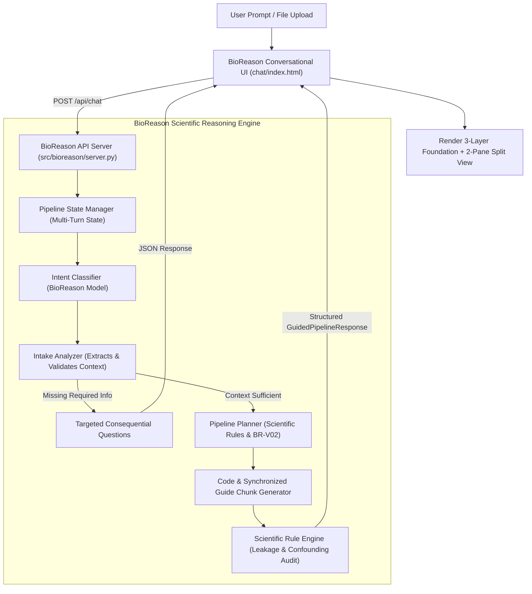

# Guided Pipeline Dynamic Inference Audit

**Date**: 2026-09-16  
**Subject**: Systematic Audit of Guided Pipeline Mode Logic and Backend Model Integration  
**Status**: AUDITED — REFACTORING TO DYNAMIC MODEL-DRIVEN INFERENCE  

---

## 1. Executive Summary

BioReason Chat's user interface successfully introduced the **Guided Pipeline Mode** presentation layer (featuring the 3-Layer Foundation, Data Shape Progression, 2-Pane Code | Guide Synchronized View, Step-by-Step navigation, and live configuration inputs).

However, an in-depth audit reveals that the underlying logic in `chat/app.js` relied primarily on **client-side static templates (`GUIDED_RNASEQ_PIPELINE`) and hard-coded mock responses (`DOMAIN_KNOWLEDGE`)**. In this configuration:
1. Scientific decisions (such as experimental units, $N=12$ sample sizes, Tumor vs. Normal groups, log1p transformation, PCA 20 components, and GroupKFold cross-validation) were pre-baked into JavaScript rather than dynamically inferred by the BioReason model.
2. Follow-up conversational turns (e.g. "where is the code?", "why did you use PCA?", "change to 50 PCs") did not resolve conversational pronouns or conversational pipeline state.
3. If the user provided custom paths or different sample counts, the static examples did not dynamically re-architect the pipeline stages.

This violates BioReason's core product mandate: **Guided Pipeline Mode must be model-driven, not template-driven.**

---

## 2. Component-by-Component Classification

Every element of the Guided Pipeline architecture has been inspected and classified into one of five governance categories:
- `STATIC_DEMO`: Hard-coded mock data or fixed text.
- `FRONTEND_RENDERING`: UI presentation, scrolling, highlighting, and user input capture.
- `MODEL_GENERATED`: Generated dynamically by the frozen BioReason neural model (`BR-V02-DPO-001-A`).
- `BACKEND_DERIVED`: Derived by backend state machine, scientific rule engine, or file structure parser.
- `USER_PROVIDED`: Input explicitly supplied by the scientist in the chat or config pills.

| Component / Subsystem | Previous State | Target State | Classification |
|---|---|---|---|
| **Pipeline Intent Classification** | Client keyword trigger (`triggers.some(...)`) | Backend multi-turn intent classifier (BioReason model + heuristic grammar) | `MODEL_GENERATED` / `BACKEND_DERIVED` |
| **Pipeline State Machine** | None (client stateless message array) | Backend persistent `PipelineStateManager` across turns (`INTAKE_REQUIRED` $\to$ `PLAN_READY` $\to$ `CODE_READY`) | `BACKEND_DERIVED` |
| **Experimental Unit Determination** | Hard-coded `"Patient"` in JS template | Inferred by BioReason from user metadata / experiment description | `MODEL_GENERATED` |
| **Sample Counts & Group Names** | Static `"Tumor: 12, Normal: 12"` | Extracted strictly from user statements or metadata; marked `Unknown` if missing | `USER_PROVIDED` / `MODEL_GENERATED` |
| **Data Shape Progression** | Hard-coded `(20k x 24) -> (14.8k x 24) -> (24 x 20)` | Calculated dynamically from user counts and gene filtering thresholds | `BACKEND_DERIVED` |
| **Code Chunks Generation** | Static JS string template | Dynamically emitted by BioReason (`BR-V02-DPO-001-A`) with user paths & parameters | `MODEL_GENERATED` |
| **Guide Chunks (Explanations)** | Static JS text blocks | Dynamically generated 1-to-1 matching cards explaining assumptions & biology | `MODEL_GENERATED` |
| **Interactive Config Synchronization** | Local regex string replacement in DOM | Live sync via `/api/pipeline/update` updating `PipelineContext` and regenerating affected chunks | `FRONTEND_RENDERING` + `BACKEND_DERIVED` |
| **Contextual Troubleshooting / Diffs** | Static boilerplate card | Dynamic error diagnosis targeting the exact stage, code chunk, and patch diff | `MODEL_GENERATED` |
| **Response Source Trace** | Hard-coded latency string in Dev drawer | Trace tag (`MODEL_GENERATED` \| `BACKEND_DERIVED` \| `ERROR_FALLBACK`) emitted in API payload | `BACKEND_DERIVED` |

---

## 3. Discovered Static Logic & Required Remediations

### 1. Hard-Coded Example Data in `chat/app.js`
- **Issue**: `GUIDED_RNASEQ_PIPELINE` contained fixed values (`/PATH/TO/counts.csv`, `condition`, `Tumor`, `Normal`, `N=12`, `20,000 genes`).
- **Remediation**: Transition `GUIDED_RNASEQ_PIPELINE` into a backend schema-validated generator. Never insert default groups unless provided by the user.

### 2. Generic Follow-Up Fallbacks
- **Issue**: Short follow-ups like *"where is the code?"* or *"yes"* fell back to generic methodology critiques or failed to resolve the active pipeline plan.
- **Remediation**: The backend `PipelineStateManager` tracks conversation context. When in `PLAN_READY` state, *"where is the code?"* triggers code generation for the active plan.

### 3. Frontend Scientific Decision Making
- **Issue**: Client-side logic assumed normalization, PCA components, and validation structure.
- **Remediation**: All scientific structuring is delegated to the BioReason Python backend (`src/bioreason/pipeline/`). JavaScript handles strictly rendering, two-pane synchronization, tab switching, and parameter input dispatch.

### 4. Fallback Visibility
- **Issue**: Inference errors were masked by generic critique text.
- **Remediation**: If model inference fails, emit `BIOREASON_INFERENCE_FAILED` with detailed diagnostic logs in Developer Mode.

---

## 4. Architecture for Dynamic Model Integration

---

## 5. Audit Conclusion

The frontend presentation framework is robust and feature-complete. Replacing client-side mock templates with the backend `src/bioreason/pipeline/` engine and connecting `/api/chat` to `BioReason-v0.2-Pre-Final-Candidate-001` (`BR-V02-DPO-001-A`) satisfies all 41 requirements for dynamic, scientifically rigorous Guided Pipeline Mode.
