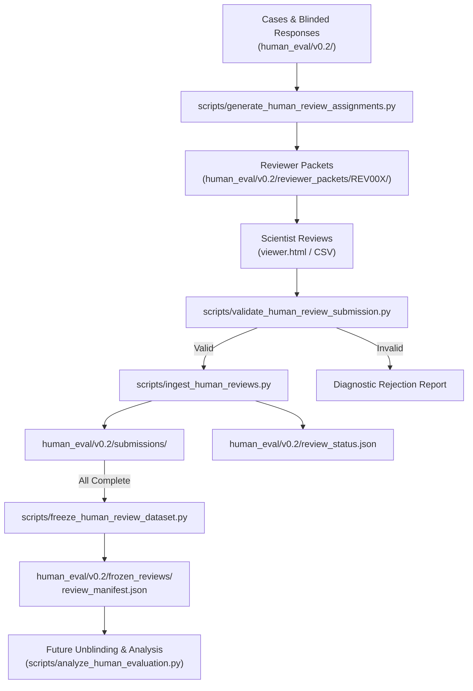

# BioReason v0.2 External Human Review Operations Manual

**Phase**: Phase 3 Increment 8B  
**Author**: BioReason Core Development Team  
**Status**: `OPERATIONS_READY` | Scientific State: `V0_2_HUMAN_REVIEW_PENDING`

---

## 1. Executive Summary & Operational Architecture

The BioReason v0.2 External Human Evaluation infrastructure enables rigorous, double-blinded, reproducible scientific peer evaluation of model outputs across 50 real-world biological and statistical scenarios.



---

## 2. Human Review Lifecycle State Machine

| State | Condition / Meaning | Actions Permitted |
| :--- | :--- | :--- |
| **`PACKAGE_READY`** | Packets generated, 0 real submissions ingested. | Distribute packets to reviewers. |
| **`REVIEW_IN_PROGRESS`** | Submissions incoming ($>0$), total coverage $<100\%$. | Ingest validated scorecards, log corrections. |
| **`HUMAN_REVIEW_INCOMPLETE`** | Submissions present but some cases have $<2$ reviews. | Follow up with pending reviewers. |
| **`HUMAN_REVIEW_COMPLETE_UNFROZEN`**| 100% case coverage ($\ge 2$ per case), unvalidated freeze. | Trigger review freeze verification. |
| **`HUMAN_REVIEW_FROZEN`** | Immutable snapshot frozen in `frozen_reviews/`. | Authorize unblinding (Stage A). |
| **`HUMAN_REVIEW_UNBLINDED`** | Models mapped to canonical names. | Execute statistical analysis. |
| **`HUMAN_ANALYSIS_COMPLETE`** | Full analysis metrics & report generated. | Unlock Stage B (Final Benchmark). |

---

## 3. Operational Command Reference

### A. Regenerate Reviewer Assignments & Packets
```bash
python3 scripts/generate_human_review_assignments.py \
    --cases human_eval/v0.2/cases.jsonl \
    --responses human_eval/v0.2/blinded_responses.jsonl \
    --guide human_eval/v0.2/REVIEWER_GUIDE.md \
    --assignments-dir human_eval/v0.2/assignments \
    --packets-dir human_eval/v0.2/reviewer_packets \
    --seed 42
```

### B. Validate Incoming Reviewer Submissions
```bash
python3 scripts/validate_human_review_submission.py \
    path/to/REV001_submissions.json \
    --manifest human_eval/v0.2/assignments/reviewer_assignment_manifest.json
```

### C. Ingest Validated Reviews
```bash
python3 scripts/ingest_human_reviews.py \
    path/to/REV001_submissions.json \
    --submissions-dir human_eval/v0.2/submissions \
    --manifest human_eval/v0.2/assignments/reviewer_assignment_manifest.json \
    --cases human_eval/v0.2/cases.jsonl \
    --status-file human_eval/v0.2/review_status.json
```

### D. Ingest a Corrected Review (Prior to Freeze)
```bash
python3 scripts/ingest_human_reviews.py \
    path/to/corrected_submission.json \
    --allow-correction \
    --correction-reason "Reviewer revised statistical validity rating on HEVAL_012"
```

### E. Freeze Completed Dataset
```bash
python3 scripts/freeze_human_review_dataset.py \
    --submissions-dir human_eval/v0.2/submissions \
    --frozen-dir human_eval/v0.2/frozen_reviews \
    --manifest human_eval/v0.2/assignments/reviewer_assignment_manifest.json \
    --cases human_eval/v0.2/cases.jsonl
```

### F. Run Analysis (Prepared — To be run only after Freeze & Unblinding)
```bash
python3 scripts/analyze_human_evaluation.py \
    --frozen-dir human_eval/v0.2/frozen_reviews \
    --unblinding-key human_eval/v0.2/randomization_manifest.json \
    --output human_eval/v0.2/human_evaluation_results.json
```

---

## 4. Governance & Blinding Invariants

1. **Zero Synthetic Review Ingestion**: Never run test fixtures into `human_eval/v0.2/submissions/` or `human_eval/v0.2/frozen_reviews/`.
2. **Strict Randomization Sealing**: `human_eval/v0.2/randomization_manifest.json` must remain unread by reviewers and evaluation operations until the review dataset freeze is complete.
3. **Locked Final Benchmark Protection**: No human evaluation script or reviewer interface may import or reference `benchmark/final_v0.2/items.json`.
