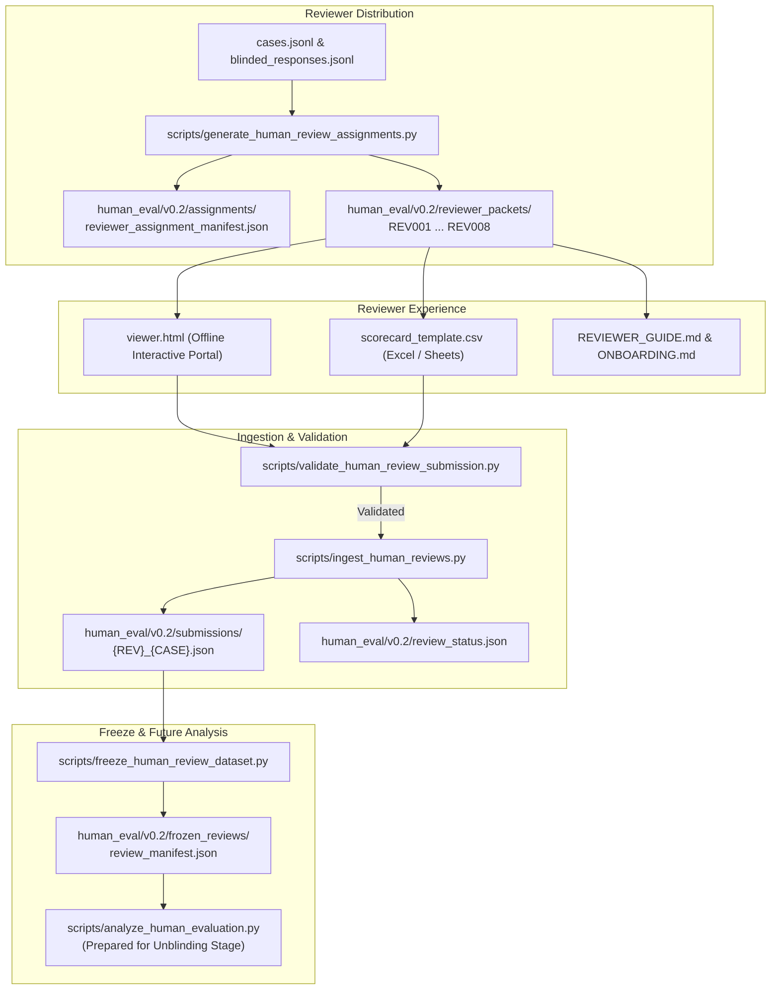

# BioReason v0.2 Phase 3 Increment 8B Report
## External Human Review Operations & Scorecard Ingestion Infrastructure

**Timestamp**: 2026-09-16T00:38:00-04:00  
**Phase Verdict**: `HUMAN_REVIEW_OPERATIONS_READY`  
**Scientific Validation Status**: `V0_2_HUMAN_REVIEW_PENDING`  
**Final Evaluation Status**: `V0_2_FINAL_EVALUATION_WAITING_ON_HUMANS`  
**Locked Final Benchmark**: `BioReasonBench-v0.2-Final` (`UNREAD / STRICTLY SEALED`)

---

## 1. Executive Summary & Objective Realization

In **Phase 3 Increment 8B**, we established a production-grade, double-blinded, reproducible operational infrastructure to ingest and validate external human expert reviews for **BioReason v0.2**.

In accordance with **Hard Governance Rule 1** and **Rule 5 ("DO NOT FABRICATE HUMAN REVIEW")**:
1. **Zero synthetic reviews** were introduced into the official submissions directory (`human_eval/v0.2/submissions/` contains 0 real review files; `review_status.json` reports `PACKAGE_READY (0/117 complete)`).
2. **Zero model unblinding** was performed (the secret randomization key `randomization_manifest.json` remains sealed).
3. **Zero benchmark exposure** occurred (`benchmark/final_v0.2/items.json` remains strictly unread and sealed).
4. **Zero model retraining or adapter modifications** occurred (model development is permanently frozen at candidate `BioReason-v0.2-Pre-Final-Candidate-001`).

All 73 automated tests in the repository pass cleanly.

---

## 2. Infrastructure & Artifact Summary



### Key Created Operational Tools & Schemas

| Artifact | Type | Description |
| :--- | :--- | :--- |
| `scripts/generate_human_review_assignments.py` | Tool | Deterministic assignment generator balancing reviewer workload (14–15 cases/reviewer) and domain specialization. |
| `scripts/validate_human_review_submission.py` | Tool | Strict JSON Schema and boundary validator; verifies 10 rubric dimensions (1–5), confidence, preference, and scans for model-revealing leak tokens. |
| `scripts/ingest_human_reviews.py` | Tool | Duplicate-protected submission ingestion pipeline with versioned correction auditing and live status calculation. |
| `scripts/freeze_human_review_dataset.py` | Tool | Dataset freeze engine; verifies $100\%$ case coverage ($\ge 2$ reviews per case), hashes all files, and outputs `review_manifest.json`. |
| `scripts/analyze_human_evaluation.py` | Tool | Pre-registered statistical analysis engine (Krippendorff's $\alpha$, weighted $\kappa$, Bradley-Terry preference rates, and Exploratory Scientist Trust Score). |
| `human_eval/v0.2/human_review_submission.schema.json` | Schema | Formal draft-07 JSON Schema for case submissions. |
| `human_eval/v0.2/reviewer_packets/` | Packets | 8 standalone packets (`REV001`–`REV008`) containing `viewer.html`, `scorecard_template.csv`, `assigned_cases.json`, and `REVIEWER_GUIDE.md`. |
| `human_eval/v0.2/REVIEWER_ONBOARDING.md` | Docs | Comprehensive scientist onboarding guide with workflow steps, time estimates, and assistance contact. |
| `human_eval/v0.2/HUMAN_REVIEW_GOVERNANCE.md` | Docs | Non-clinical disclaimer, reviewer pseudonymous privacy, open-science data release policy, and acknowledgment options. |
| `HUMAN_REVIEW_OPERATIONS.md` | Docs | Complete operations manual for review distribution, ingestion, correction handling, freeze, and analysis. |
| `tests/test_human_review_ops.py` | Tests | 8 comprehensive unit and integration tests verifying all governance invariants and operational tooling. |

---

## 3. Assignment Design & Workload Optimization

- **Total Cases**: 50 independent cases across 15 biological disciplines.
- **Reviewer Pool**: 8 expert reviewers across 5 qualification tiers (`BIOSTATISTICIAN`, `COMPUTATIONAL_BIOLOGIST`, `BIOINFORMATICIAN`, `EXPERT_DOMAIN`, `GENERAL_BIOLOGICAL_SCIENTIST`).
- **Target Coverage**:
  - **Standard Cases**: 33 cases assigned $\ge 2$ independent reviewers.
  - **High-Priority Complex Cases** (survival analysis, longitudinal omics, biostatistics, variant interpretation): 17 cases assigned 3 independent reviewers (triple review).
  - **Cases with $<2$ Reviews**: 0.
- **Reviewer Workload**:
  - `REV001`: 14 cases (Biostatistics / Survival)
  - `REV002`: 14 cases (Computational Biology / Spatial Transcriptomics)
  - `REV003`: 15 cases (Bioinformatics / ATAC / Genomics)
  - `REV004`: 15 cases (Expert Domain / Metabolomics / Proteomics)
  - `REV005`: 14 cases (Biostatistics / Clinical Design)
  - `REV006`: 15 cases (Computational Biology / ML / Variants)
  - `REV007`: 15 cases (General Biological Scientist / Microbiome)
  - `REV008`: 15 cases (Bioinformatics / GWAS / Variants)
  - **Total Planned Reviews**: 117 case-reviews.

---

## 4. Blinding & Benchmark Protection Audit

1. **Reviewer Packet Blinding**:
   - Automated text scanning confirmed zero model names (`Qwen`, `BioReason`, `BR-DPO`, `BR-SFT`, `checkpoint-step`) inside `assigned_cases.json` or `scorecard_template.csv`.
   - The secret randomization file `randomization_manifest.json` is strictly excluded from all reviewer packets.
2. **Locked Final Benchmark Protection**:
   - Automated test `test_governance_final_benchmark_protection` verified that zero operational scripts import, read, or reference `benchmark/final_v0.2/items.json`.
   - `benchmark/final_v0.2/items.json` SHA-256 hash verified as exactly `884dd9c5b677c13ae21b643046d3ef02d653a503e09bb8056fc34241bcbc35b2` (`UNREAD / STRICTLY SEALED`).

---

## 5. Automated Test Suite Status

```text
============================= test session starts ==============================
rootdir: /Users/albertopaz/Biomindv2
plugins: langsmith-0.3.38, zarr-3.1.3, anyio-4.6.2
collected 73 items

tests/test_cli.py .....                                                  [  6%]
tests/test_contamination.py ....                                         [ 12%]
tests/test_evaluator.py .                                                [ 13%]
tests/test_human_review_ops.py ........                                  [ 24%]
tests/test_phase2_sft.py ....                                            [ 30%]
tests/test_phase2b_preference.py ...                                     [ 34%]
tests/test_phase3_increment8_gate.py ...                                 [ 38%]
tests/test_rules.py ...........                                          [ 53%]
tests/test_schemas.py ......                                             [ 61%]
tests/test_v0_2_dpo_full.py ...                                          [ 65%]
tests/test_v0_2_dpo_smoke.py ...                                         [ 69%]
tests/test_v0_2_final_benchmark.py ...                                   [ 73%]
tests/test_v0_2_foundation.py .....                                      [ 80%]
tests/test_v0_2_generalization.py ......                                 [ 89%]
tests/test_v0_2_sft_curriculum.py .....                                  [ 95%]
tests/test_v0_2_sft_full.py ...                                          [100%]

============================== 73 passed in 2.57s ==============================
```

---

## 6. Remaining Action Required for Full Evaluation Completion

To progress from `V0_2_HUMAN_REVIEW_PENDING` to full Stage A & Stage B evaluation completion:
1. Distribute reviewer packets (`human_eval/v0.2/reviewer_packets/REV001`–`REV008`) to the external scientist panel.
2. Ingest completed scorecards via `scripts/ingest_human_reviews.py` until `review_status.json` reaches `HUMAN_REVIEW_COMPLETE_UNFROZEN` ($117 / 117$ reviews completed).
3. Freeze the completed review dataset using `scripts/freeze_human_review_dataset.py` into `human_eval/v0.2/frozen_reviews/`.
4. Authorize model unblinding and execute `scripts/analyze_human_evaluation.py` to generate `V0_2_HUMAN_EVALUATION_REPORT.md`.
5. Proceed to Stage B one-time evaluation on `BioReasonBench-v0.2-Final`.
