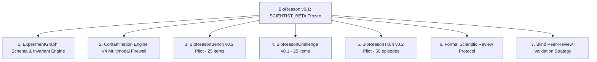

# Phase 3 Baseline: BioReason v0.2 Strategy & Foundation

**Status**: BIOREASON_V0_1_FROZEN | PHASE_3_V0_2_INITIALIZED  
**Date**: 2026-09-15  
**Lineage**: BioReason v0.1 (`BR-DPO-002-A`) $\rightarrow$ BioReason v0.2 Foundation  

---

## 1. Permanent Freeze of BioReason v0.1

All BioReason v0.1 artifacts, datasets, weights, and benchmarks are permanently frozen and immutable:

- **Base Model**: `Qwen/Qwen2.5-14B-Instruct`
- **SFT Checkpoint**: `BR-SFT-001-A` Epoch 2.0
- **DPO Checkpoint**: `BR-DPO-002-A`
- **Release Status**: `SCIENTIST_BETA`
- **Generalization Verdict**: `STRONG_GENERALIZATION` (within BioReasonBench-v0.1)
- **Final Benchmark Consumption**: The 51-item `BioReasonBench-v0.1` final test partition is marked `CONSUMED_FOR_V0_1_FINAL_EVALUATION` and will **never** be reused as a pristine test for v0.2.

---

## 2. BioReason v0.1 Performance Baseline Summary

The one-time locked final evaluation ($N=51$) established the baseline capabilities of BioReason v0.1:

| Metric | Base Model (Qwen-14B) | Selected SFT (Epoch 2.0) | BioReason v0.1 (DPO) | Net Gain vs Base |
| :--- | :--- | :--- | :--- | :--- |
| **Overall Binary Accuracy** | 66.67% (34/51) | 92.16% (47/51) | **94.12% (48/51)** | **+27.45 pp** |
| **Flaw Detection Sensitivity** | 89.19% (33/37) | 91.89% (34/37) | **91.89% (34/37)** | **+2.70 pp** |
| **Scientific False Alarm Rate** | 92.86% (13/14) | 7.14% (1/14) | **0.00% (0/14)** | **-92.86 pp** |
| **Valid Hard-Negative Accuracy** | 7.14% (1/14) | 92.86% (13/14) | **100.00% (14/14)**| **+92.86 pp** |
| **High-Confidence Critical Errors** | 7.84% (4/51) | 5.88% (3/51) | **0.00% (0/51)** | **-7.84 pp** |
| **Primary Issue Prioritization** | 27.45% (14/51) | 66.67% (34/51) | **94.12% (48/51)** | **+66.67 pp** |
| **Correction Actionability** | 0.0980 | 0.3725 | **0.9020** | **+0.8040** |
| **BioReason Balance Score** | -0.1356 | +0.6366 | **+0.8603** | **+0.9959** |

---

## 3. Residual Error Audit & Motivation for v0.2

Although BioReason v0.1 achieved 94.12% accuracy on BioReasonBench-v0.1, the comprehensive error review (`FINAL_ERROR_REVIEW.md`) identified three critical structural challenges:

1. **Subtle Resampling / SMOTE Leakage (`BENCH_0233`)**:
   - The model missed oversampling leakage embedded within a dense clinical classification narrative because the author framed SMOTE as a standard preprocessing step.
2. **Longitudinal Serial-Biopsy Pseudoreplication (`BENCH_0109`)**:
   - The model failed to recognize that multiple biopsies over time from the same patient constitute correlated longitudinal measures rather than independent samples.
3. **Adversarial Tool-Convergence Confounding (`BENCH_0266`)**:
   - The model was partially swayed by the fact that 5 independent batch correction tools agreed on the top 15 genes, failing to enforce that complete collinearity between sequencing center and phenotype renders the design mathematically unidentifiable.

---

## 4. BioReason v0.2 Strategic Pillars

---

## 5. Summary of Phase 3 Increment 1 Accomplishments

1. **Topological Representation (`ExperimentGraph`)**:
   - Created `src/bioreason/schemas/experiment_graph.py` with typed nodes (`SUBJECT`, `SAMPLE`, `OBSERVATION`, `BATCH`, `TIMEPOINT`, `ASSAY`, `TREATMENT`, `TRANSFORMATION`, `MODEL`, `PARTITION`) and edge relations (`DERIVED_FROM`, `NESTED_WITHIN`, `PAIRED_WITH`, `MEASURED_AT`, `PROCESSED_BY`, `SPLIT_INTO`, `TRAINED_ON`, `EVALUATED_ON`).
   - Implemented automated partition leakage detection and topological pseudoreplication analysis.

2. **Multimodal Contamination Firewall (`ContaminationEngineV4`)**:
   - Created `src/bioreason/datasets/contamination_v4.py` supporting exact text, normalized text, n-gram Jaccard, ScenarioSignature matching, subword TF-IDF cosine similarity, study-structure fingerprinting, and source/DOI overlap checks.

3. **Core Standards & Protocols**:
   - Created `docs/SCIENTIFIC_REVIEW_PROTOCOL.md` (Reviewer roles, mandatory dual-review for causality/pseudoreplication/confounding, ordinal scoring, inter-rater reliability metrics $\kappa$ and $\alpha$).
   - Created `docs/SCIENTIFIC_INVARIANTS.md` (9 non-negotiable mathematical/biological invariants).
   - Created `docs/EXTERNAL_VALIDATION_PLAN.md` (Real-world study critique, triple-blinded multi-model evaluation, peer-review mode, inverse study design mode, regression protection suite).

4. **Pilot Dataset Creation (100 New Items Across 16+ Domains)**:
   - `benchmark/v0.2/bioreason_bench_v0_2_pilot.json` ($N=25$, 100% expert validated, 24% hard negatives).
   - `challenge/bioreason_challenge_v0.1/bioreason_challenge_v0_1.json` ($N=25$, real-world literature grounded).
   - `training_data/v0.2/candidate_episodes_v0_2_pilot.json` ($N=50$, 100% human/expert reviewed, 0% unreviewed).

5. **Verification & Audit**:
   - Executed Contamination Engine V4: **0 flags across all splits**.
   - Generated `V0_2_DATA_AUDIT.md`.
   - Executed full test suite: **39 / 39 tests passing (100% green)** in 2.13s.
