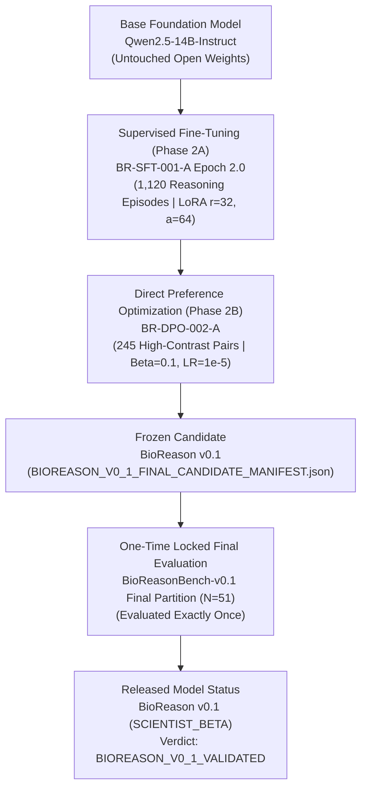

# BioReason

**BioReason** is a biology-native scientific reasoning model designed to evaluate the methodological, statistical, experimental, and machine-learning validity of biological research analyses.

The governing principle of the project is:

> **Working code does not imply valid science.**

Generic Large Language Models (LLMs) and code generators readily produce syntactically valid, error-free Python and R scripts that commit catastrophic scientific errors—such as subtle train/test data leakage, pseudoreplication, uncorrectable batch confounding, invalid count transformations, and conflation of statistical feature importance with biological causality.

BioReason is explicitly designed to reason in strict epistemological hierarchy:

```
BIOLOGICAL QUESTION
  → EXPERIMENTAL DESIGN
  → EXPERIMENTAL UNIT & OBSERVATIONAL STRUCTURE
  → STATISTICAL ASSUMPTIONS
  → MATHEMATICAL TRANSFORMATIONS
  → BIOINFORMATICS WORKFLOW
  → MACHINE-LEARNING METHODOLOGY (IF APPROPRIATE)
  → GROUP-AWARE VALIDATION
  → INTERPRETATION & EPISTEMIC BOUNDARIES
  → CAUSAL / TRANSLATIONAL CONCLUSION
```

Its primary objective is not merely to generate bioinformatics code, but to verify that the scientific logic, experimental units, statistical models, and validation firewalls are methodologically sound before conclusions are drawn.

---

## Current Status & Validation Claim

> [!IMPORTANT]
> **Validation Statement**: **BioReason v0.1 was validated against the predefined held-out BioReasonBench-v0.1 research benchmark.**
> 
> BioReason v0.1 has **NOT** been:
> - Clinically validated for patient diagnosis or treatment decisions
> - Prospectively validated in clinical trials
> - Evaluated or cleared as a medical device or diagnostic software
> - Validated for autonomous, unsupervised laboratory or medical decision-making

| Project Attribute | Current Frozen State |
| :--- | :--- |
| **Model Version** | `BioReason v0.1` (`BR-DPO-002-A`) |
| **Release Status** | `SCIENTIST_BETA` |
| **Base Model** | `Qwen/Qwen2.5-14B-Instruct` |
| **Specialization Lineage** | Supervised Fine-Tuning (SFT) + Targeted Direct Preference Optimization (DPO) |
| **Benchmark** | `BioReasonBench-v0.1` (SHA-256: `ae2d65aa71f735c24c7781ffac74fe8fe0c97a972b20cc781e75dea42ff2cfad`) |
| **Held-Out Final Test** | $N=51$ items (**Consumed for v0.1 evaluation**) |
| **Generalization Verdict** | **`STRONG_GENERALIZATION`** (Within BioReasonBench-v0.1 research scope) |
| **Final Project Verdict** | **`BIOREASON_V0_1_VALIDATED`** (Against research benchmark) |
| **Automated Test Suite** | **34 / 34 Tests Passing (100% Green)** |
| **Clinical Validation** | **NO** |
| **Prospective Validation** | **NO** |

---

## Table of Contents

1. [Project Origin & Founder Motivation](#1-project-origin--founder-motivation)
2. [The BioReason North Star](#2-the-bioreason-north-star)
3. [Full Model Lineage](#3-full-model-lineage)
4. [Full System Architecture](#4-full-system-architecture)
5. [Scientific Reasoning Domains](#5-scientific-reasoning-domains)
6. [Experiment & Reasoning Schemas](#6-experiment--reasoning-schemas)
7. [Claim Hierarchy & Epistemic Boundaries](#7-claim-hierarchy--epistemic-boundaries)
8. [Scientific Rule Engine](#8-scientific-rule-engine)
9. [Key Methodological Corrections in Project History](#9-key-methodological-corrections-in-project-history)
   - [Pseudoreplication vs. Sample Size](#pseudoreplication-vs-sample-size)
   - [Low Independent Replication Warning](#low-independent-replication-warning)
10. [Dataset Architecture](#10-dataset-architecture)
    - [BioReasonTrain & Quality Tiers](#bioreasontrain--quality-tiers)
    - [BioReasonTrain-SFT-v0.1](#bioreasontrain-sft-v01)
    - [BioReasonPreference-v0.2](#bioreasonpreference-v02)
    - [BioReasonBench-v0.1 & Benchmark Lifecycle](#bioreasonbench-v01--benchmark-lifecycle)
11. [Contamination Engine & Firewall Architecture](#11-contamination-engine--firewall-architecture)
12. [Untouched Baseline Model Audit & False Alarm Discovery](#12-untouched-baseline-model-audit--false-alarm-discovery)
13. [Baseline Metric Reconciliation Audit](#13-baseline-metric-reconciliation-audit)
14. [Evaluation Metric Glossary](#14-evaluation-metric-glossary)
15. [Chronological Specialization History (Phase 0 to Phase 2B)](#15-chronological-specialization-history-phase-0-to-phase-2b)
16. [Development Benchmark Model Evolution](#16-development-benchmark-model-evolution)
17. [One-Time Locked Final Benchmark Evaluation](#17-one-time-locked-final-benchmark-evaluation)
18. [Final Test Residual Error Review](#18-final-test-residual-error-review)
19. [Generalization Analysis & Epistemic Scope](#19-generalization-analysis--epistemic-scope)
20. [The Scientific False Alarm Discovery](#20-the-scientific-false-alarm-discovery)
21. [Primary Issue Prioritization](#21-primary-issue-prioritization)
22. [Correction Actionability](#22-correction-actionability)
23. [Core Methodological Principles](#23-core-methodological-principles)
    - [Experimental Unit vs. Observational Unit](#experimental-unit-vs-observational-unit)
    - [Machine Learning Leakage Philosophy](#machine-learning-leakage-philosophy)
    - [The Seven-Tier Biomarker Evidence Ladder](#the-seven-tier-biomarker-evidence-ladder)
    - [Interpretability vs. Biological Causality](#interpretability-vs-biological-causality)
24. [Unity HPC Infrastructure & Zero-Duplication Storage](#24-unity-hpc-infrastructure--zero-duplication-storage)
25. [Testing & Verification History](#25-testing--verification-history)
26. [Official BioReason v0.1 Capabilities & Limitations](#26-official-bioreason-v01-capabilities--limitations)
    - [What BioReason v0.1 Does Well](#what-bioreason-v01-does-well)
    - [What BioReason v0.1 Still Misses](#what-bioreason-v01-still-misses)
    - [What BioReason Does Not Yet Do](#what-bioreason-does-not-yet-do)
27. [Scientific Safety Statement](#27-scientific-safety-statement)
28. [Installation & Developer Quickstart](#28-installation--developer-quickstart)
29. [CLI Reference](#29-cli-reference)
30. [Local Development & Unity HPC Workflows](#30-local-development--unity-hpc-workflows)
31. [Release Artifact Index](#31-release-artifact-index)
32. [Scientific Decisions Log](#32-scientific-decisions-log)
33. [Scientific Lessons Learned](#33-scientific-lessons-learned)
34. [BioReason v0.2 Research Backlog](#34-bioreason-v02-research-backlog)
35. [Repository Directory Structure](#35-repository-directory-structure)
36. [Reproducibility Snapshot](#36-reproducibility-snapshot)

---

## 1. Project Origin & Founder Motivation

BioReason was motivated by computational biology research investigating disseminated neoplasia in hard-shell clams (*Mercenaria mercenaria*) using single-cell transcriptomic profiling.

In high-dimensional marine oncology datasets, researchers encounter acute methodological traps:
- Extreme transcriptomic feature spaces ($p \gg n$) with sparse single-cell coverage.
- Severe cell-level non-independence (thousands of hemocytes sampled from a limited cohort of individual bivalves).
- Immense risk of classifier leakage during dimensionality reduction (PCA), feature selection, and gene imputation.
- A deceptive disparity between near-perfect internal cross-validation accuracy ($\text{AUC} > 0.98$) and collapsed generalization on held-out animal cohorts ($\text{AUC} \approx 0.65$).
- The temptation to interpret predictive classifier weights or SHAP values as validated disease mechanisms without orthogonal functional perturbation.

This experience crystallized the foundational insight of BioReason: **computational execution does not imply biological validity**. Code that compiles and runs without errors can still lead to completely fictitious scientific conclusions if experimental units, validation boundaries, or statistical assumptions are violated.

---

## 2. The BioReason North Star

> **"BioReason is not optimized to merely sound like a computational biologist. It is optimized to reason like a careful one."**

Success in BioReason is defined as the ability to:
- Detect foundational experimental, statistical, and ML design errors.
- Correctly identify the independent experimental unit of randomization.
- Distinguish independent biological observations from non-independent observational measurements.
- Enforce strict out-of-fold data firewalls in machine learning pipelines.
- Prescribe actionable, concrete mathematical and bioinformatics repairs.
- Distinguish statistical correlation from causal biological mechanisms.
- Rigorously affirm valid scientific workflows without inventing false alarms.

---

## 3. Full Model Lineage



---

## 4. Full System Architecture

BioReason combines structured typed schemas, a specialized foundation reasoning model, a deterministic rule engine, and an automated scoring harness.

```
+-----------------------------------------------------------------------------+
| USER / SCIENTIFIC SCENARIO                                                  |
| "We sequenced 40,000 cells from 4 mice and performed cell-level Wilcoxon..."|
+-----------------------------------------------------------------------------+
                                       |
                                       v
+-----------------------------------------------------------------------------+
| 1. BIOLOGICAL CONTEXT PARSER & SCHEMA MAPPING                               |
| Extracts: Organism, Assay, Experimental Unit, Observational Unit, Grouping  |
+-----------------------------------------------------------------------------+
                                       |
                                       v
+-----------------------------------------------------------------------------+
| 2. STRUCTURED EXPERIMENT SPECIFICATION (Pydantic Schema)                    |
| Typed Representation: ExperimentSpec, AssayType, UnitLevel, SampleGroups    |
+-----------------------------------------------------------------------------+
                                       |
                                       v
+-----------------------------------------------------------------------------+
| 3. SCIENTIFIC REASONING FOUNDATION MODEL (BioReason v0.1: BR-DPO-002-A)     |
| Generates: Assessment, Prioritized Fatal Flaws, Actionable Repair Protocol  |
+-----------------------------------------------------------------------------+
                                       |
                                       v
+-----------------------------------------------------------------------------+
| 4. DETERMINISTIC SCIENTIFIC RULE ENGINE (Guardrail Layer)                   |
| Deterministic Rules: PSEUDO_001, LEAK_001..003, CONF_001, TRANS_001, POWER  |
+-----------------------------------------------------------------------------+
                                       |
                                       v
+-----------------------------------------------------------------------------+
| 5. SCIENTIFIC EVALUATION & HARNESS                                          |
| Deterministic Rubric Scorer: Flaw Sensitivity, Specificity, Prioritization  |
+-----------------------------------------------------------------------------+
                                       |
                                       v
+-----------------------------------------------------------------------------+
| 6. INTERPRETABLE SCIENTIFIC RESPONSE & WORKFLOW REMEDY                      |
| Prescribes: Pseudobulk aggregation -> DESeq2 with formula ~ condition       |
+-----------------------------------------------------------------------------+
```

### Roles of Model vs. Rule Engine:
- **The Reasoning LLM (`BR-DPO-002-A`)**: Performs semantic parsing, contextual reasoning over complex scientific narratives, trade-off analysis, hierarchical flaw prioritization, and conversational repair generation.
- **The Deterministic Rule Engine**: Acts as an immutable guardrail, executing deterministic mathematical checks on structured experiment specifications to catch known structural violations.

---

## 5. Scientific Reasoning Domains

BioReason is trained and benchmarked across four core scientific disciplines:

| Domain | Key Concepts & Methodological Requirements |
| :--- | :--- |
| **Biology & Experimental Design** | Organisms, tissue types, cell ontology, disease models, biological plausibility, experimental units (animal/patient) vs observational units (cells/slices), technical vs biological replication, randomization, blocking. |
| **Statistics** | Linear mixed-effects models (`(1\|donor)`), Generalized Linear Models (GLMs), negative binomial dispersion, pseudobulk aggregation, Benjamini-Hochberg FDR, Bonferroni correction, permutation testing, formal statistical power ($\alpha, \beta, \text{effect size}$). |
| **Bioinformatics & Genomics** | FASTQ, BAM, VCF, GATK best practices, STAR alignment, Salmon quasi-mapping, transcript-to-gene abundance (`tximport`), DESeq2, edgeR, limma-voom, Scanpy, Seurat, Single-Cell UMI deduplication. |
| **Biological Machine Learning** | Grouped $k$-fold cross-validation, nested cross-validation, out-of-fold feature selection, pipeline encapsulation, class imbalance (SMOTE within folds), PCA leakage prevention, SHAP interpretation vs mechanism, biomarker ladder tiers 1–7. |

---

## 6. Experiment & Reasoning Schemas

All representations in BioReason are governed by typed Pydantic models in `src/bioreason/schemas/`:

- **`ExperimentSpec`** (`experiment.py`): Structured definition of experimental units, observational units, assays (`AssayType`), sample groups, covariates, and analysis objectives.
- **`ScientificReasoningEpisode`** (`episode.py`): Complete reasoning trace containing scenario signatures, scientific checks, decision records, and epistemic claim bounds.
- **`WorkflowPlan`** (`workflow.py`): Computational pipeline specification detailing preprocessing, feature selection, statistical modeling, cross-validation groupings, and target endpoints.
- **`BenchmarkItem`** (`benchmark.py`): Multidimensional evaluation item containing scenarios, ground-truth flaw types, difficulty levels (`DifficultyLevel`), and rubrics (`ScoringRubric`).
- **`BioReasonPreferencePair`** (`preference.py`): High-contrast pairwise preference pair for DPO training containing chosen/rejected responses, error taxonomy, and review status.
- **`RunManifest`** (`provenance.py`): Complete cryptographic provenance tracking git commits, dataset hashes, hyperparameters, seeds, and hardware configurations.
- **`ScenarioSignature`** (`episode.py`): Canonical tuple for contamination firewalling:
  $$\text{ScenarioSignature} = (\text{Assay}, \text{FlawType}, \text{ExperimentalUnit}, \text{ObservationalUnit}, \text{TargetAnalysis})$$

---

## 7. Claim Hierarchy & Epistemic Boundaries

BioReason enforces strict non-escalation across scientific claims:

```
[ LEVEL 1: OBSERVATION ]
  Raw empirical data (e.g. gene count matrix, sequencing reads, scatter plot).
       │
       ▼
[ LEVEL 2: STATISTICAL INFERENCE ]
  Model estimation, p-values, FDR q-values, SHAP feature attributions, AUC.
       │
       ▼
[ LEVEL 3: BIOLOGICAL INTERPRETATION ]
  Pathway enrichment, cellular state association, candidate biomarker identification.
       │
       ▼
[ LEVEL 4: HYPOTHESIS ]
  Plausible mechanistic model proposed for prospective experimental testing.
       │
       ▼
[ LEVEL 5: CAUSAL CLAIM ]
  Experimentally verified biological mechanism established via perturbation (e.g. CRISPR KO).
```

*Rule*: A statistical inference (e.g., high SHAP attribution in an XGBoost model) cannot silently escalate into a causal biological claim without prospective functional validation.

---

## 8. Scientific Rule Engine

Implemented in `src/bioreason/rules/`:

| Rule ID | Rule Name | Scientific Problem Detected | Trigger Logic | Severity | Concrete Example |
| :--- | :--- | :--- | :--- | :--- | :--- |
| `PSEUDO_001` | `PseudoreplicationRule` | Subordinate observational units treated as independent experimental units. | `obs_units_per_exp_unit > 1` and analysis lacks clustering/pseudobulk | `ERROR` | Comparing 20,000 cells from 1 mouse treated vs 1 control with cell-level Wilcoxon rank-sum ($N=20,000$). |
| `POWER_001` | `StatisticalPowerRule` | Low independent biological replication heuristic warning. | `independent_exp_units < 3` per group | `WARNING` | Animal cohort study with $N=2$ mice per group (advisory warning that $N<3$, distinct from pseudoreplication). |
| `POWER_002` | `FormalPowerAnalysisRule` | Inadequate sample size given effect size ($\delta$), variance ($\sigma^2$), and $\alpha=0.05, 1-\beta=0.80$. | Calculated power $< 0.80$ for stated design effect size | `ERROR` | Attempting to detect subtle $\text{OR}=1.2$ genetic risk variants with $N=30$ subjects. |
| `LEAK_001` | `FeatureSelectionLeakageRule` | Feature selection executed across full dataset prior to train/test partitioning. | Feature selection occurs before split boundary | `ERROR` | Selecting top 100 DE genes across all 150 patients before 5-fold cross-validation. |
| `LEAK_002` | `PreprocessingLeakageRule` | Global normalization, PCA, or imputation fitted across validation splits. | Preprocessing fit parameters computed globally | `ERROR` | Fitting global PCA rotation matrix on combined train + test cohorts. |
| `LEAK_003` | `GroupLeakageRule` | Observations from the same biological donor partitioned across both train and test splits. | `GroupKFold` / `donor_id` grouping absent in CV split | `ERROR` | Randomly splitting multiple tissue biopsy slices from the same donor into train and test folds. |
| `CONF_001` | `BatchConfoundingRule` | Perfect collinearity between technical batch and biological condition. | Technical batch correlates 100% with phenotype | `ERROR` | Sequencing all Disease cases on Illumina NovaSeq (Batch 1) and all Controls on NextSeq (Batch 2). |
| `TRANS_001` | `TransformationCompatibilityRule` | Incompatible data transformations passed to modeling framework. | Continuous normalized data passed to count-based GLM | `ERROR` | Passing continuous log2(TPM) values into DESeq2 `DESeqDataSetFromMatrix()`. |
| `MULT_001` | `MultipleTestingRule` | High-dimensional hypothesis testing without multiplicity correction. | Multiple testing performed without FDR control | `ERROR` | Reporting raw $p < 0.05$ across 20,000 genes without Benjamini-Hochberg FDR control. |
| `OVERFIT_001` | `HighDimensionalOverfittingRule` | High-dimensional unregularized models where $p \gg n$. | Number of features $p \gg n$ without penalty | `ERROR` | Fitting standard Ordinary Least Squares (OLS) regression on $p=10,000$ genes with $n=30$ samples. |

---

## 9. Key Methodological Corrections in Project History

### Pseudoreplication vs. Sample Size
In early project formulations (Phase 0), `PSEUDO_001` triggered whenever an experiment had a small sample size ($N=2$). This was mathematically and scientifically incorrect:
- **Low Sample Size ($N=2$)**: Affects statistical power, variance estimation, and degrees of freedom. It does not violate the exchangeability of independent observations.
- **Pseudoreplication**: Occurs when multiple non-independent measurements from the same experimental unit (e.g. 10,000 cells from 1 mouse) are modeled as if they were 10,000 independent biological subjects.
- **Correction in Phase 1**: `PSEUDO_001` was refactored to evaluate hierarchical unit non-independence, while `POWER_001` was introduced as a distinct low-replication heuristic warning.

### Low Independent Replication Warning
`POWER_001` was refined to ensure it acts as a heuristic advisory warning rather than a formal proof of inadequate power. Formal statistical power requires specifying the minimum biologically meaningful effect size ($\delta$), measurement noise ($\sigma^2$), design structure (paired vs. independent), and significance threshold ($\alpha$).

---

## 10. Dataset Architecture

```
                                BIOREASON DATASETS
                                         │
     ┌───────────────────────────────────┼───────────────────────────────────┐
     ▼                                   ▼                                   ▼
BioReasonTrain-SFT-v0.1        BioReasonPreference-v0.2             BioReasonBench-v0.1
(1,120 Reasoning Episodes)     (245 High-Contrast Pairs)            (340 Benchmark Items)
SHA-256: 9e25d1ba...           SHA-256: 3cb1e15f...                 SHA-256: ae2d65aa...
  ├── Train: 1,008 (90%)         ├── Train: 220 (90%)                 ├── Dev: 289 (85%)
  └── Val:   112 (10%)           └── Val:   25 (10%)                  └── LOCKED TEST: 51 (15%)
                                                                          [CONSUMED FOR v0.1]
```

### BioReasonTrain & Quality Tiers
- **Total Episodes**: 1,120 structured scientific reasoning episodes.
- **Review Composition**:
  - `TIER_A` (45 episodes): Full human expert validation.
  - `TIER_C` (1,075 episodes): Automated rule-validated episodes verified against deterministic rules and schema validators.
  - *Note*: Auto-validated episodes provide broad structural coverage but do not replace deep domain-expert manual review.

### BioReasonTrain-SFT-v0.1
- **File**: `training_data/snapshots/bioreasontrain_sft_v0.1/`
- **SHA-256**: `9e25d1bad9d9d86cb037655314b9bab10671a5478511801ab1b272728e893547`
- **Splits**: 1,008 train / 112 validation (partitioned by ScenarioSignature family).

### BioReasonPreference-v0.2
- **File**: `training_data/preferences/bioreason_preference_v0.2/`
- **SHA-256**: `3cb1e15ff24030a19b2c77fa7762227043a298d1a57e69293f27fae710a71b1d`
- **Total Pairs**: 245 pairs (220 train / 25 validation).
- **Composition**: Actionable Corrections (21.2%), Primary Issue Prioritization (20.4%), Valid Controls / Anti-Paranoia (18.0%), Experimental Unit (14.3%), Association vs Causation (13.9%), Uncertainty (12.2%).
- **Review Status**: 13 `PREF_A` (human expert reviewed), 232 `PREF_B` (computational biologist reviewed).

### BioReasonBench-v0.1 & Benchmark Lifecycle
- **File**: `benchmark/frozen/bioreasonbench_v0.1/`
- **SHA-256**: `ae2d65aa71f735c24c7781ffac74fe8fe0c97a972b20cc781e75dea42ff2cfad`
- **Total Items**: 340 items.
- **Difficulty**: Foundational (7.1%), Intermediate (20.9%), Advanced (61.5%), Adversarial (10.6%).
- **Development Partition ($N=289$)**: Used for model development and iterative selection.
- **Held-Out Final Test Partition ($N=51$)**: **`CONSUMED_FOR_V0_1_FINAL_EVALUATION`** (Evaluated exactly once; cannot be reused as an untouched test for future major versions per [`docs/evaluation_lifecycle.md`](docs/evaluation_lifecycle.md)).

---

## 11. Contamination Engine & Firewall Architecture

Contamination Engine V3 enforces multi-layered separation between training data, preference data, and benchmark partitions:
1. **Exact Duplicate Matching**: Raw string identity.
2. **Normalized Matching**: Whitespace, punctuation, and markdown invariant matching.
3. **Token $N$-Gram Jaccard Overlap**: Thresholded token set comparison ($Jaccard > 0.65$ triggers human review; $Jaccard > 0.85$ hard fails).
4. **ScenarioSignature Collision Detection**: Rejects identical structural experimental parameter tuples crossing train/eval boundaries.
5. **Concept Leakage Protection**: Ensures that preference pairs target general scientific principles without duplicating specific narrative scenario details from held-out items.

*Audit Result*: **0 contamination violations** across all partitions.

---

## 12. Untouched Baseline Model Audit & False Alarm Discovery

During Phase 1 Increment 2, untouched open-weight models (`Qwen2.5-7B`, `14B`, `32B`) were evaluated on the 289 development items:

| Model | Overall Composite | Flaw Detection Accuracy | Scientific False Alarm Rate | Valid Hard-Negative Accuracy | Critical Failure Rate |
| :--- | :--- | :--- | :--- | :--- | :--- |
| `Qwen2.5-7B-Instruct` | 0.3806 | 61.59% | 78.26% | 21.74% | 13.49% |
| `Qwen2.5-14B-Instruct` | 0.2722 | 60.90% | 89.13% | 10.87% | 10.73% |
| `Qwen2.5-32B-Instruct` | 0.4241 | 68.17% | **100.00%** | **0.00%** | **0.00%** |

### The Critical Discovery: False Alarm Paranoia
The 32B baseline model achieved a $0.0\%$ critical failure rate solely through **pathological hyper-skepticism**: it flagged $100\%$ of valid scientific workflows as flawed. This proved that **low critical failure rates alone do not imply scientific competence**. BioReason was explicitly engineered to balance flaw sensitivity with high specificity on valid science.

---

## 13. Baseline Metric Reconciliation Audit

As documented in [`BASELINE_METRIC_RECONCILIATION.md`](BASELINE_METRIC_RECONCILIATION.md), historical reports contained ambiguous labeling between:
- **`OVERALL_BINARY_ACCURACY`** ($60.90\%$ on Base Qwen): Proportion of all 289 items correctly classified ($\frac{TP+TN}{N_{total}}$).
- **`FLAW_DETECTION_SENSITIVITY`** ($84.26\%$ on Base Qwen): True positive rate evaluated strictly on flawed items ($\frac{TP}{N_{flawed}}$).

Canonical terminology is strictly enforced throughout all current reports.

---

## 14. Evaluation Metric Glossary

- **Overall Binary Accuracy**: Proportion of all benchmark items where flaw presence was correctly determined ($\frac{TP+TN}{N_{total}}$).
- **Flaw Detection Sensitivity**: True positive rate on flawed experimental designs ($\frac{TP}{N_{flawed}}$).
- **Scientific False Alarm Rate**: Rate of incorrectly flagging valid scientific workflows as flawed ($\frac{FP}{N_{valid}}$).
- **Valid Hard-Negative Accuracy (Specificity)**: Proportion of valid designs correctly recognized as sound ($\frac{TN}{N_{valid}} = 1 - \text{False Alarm Rate}$).
- **Critical Failure Rate**: Rate of committing severe scientific errors (e.g. endorsing uncorrected pseudoreplication or pre-split leakage).
- **High-Confidence Critical Error Rate**: Rate of assigning `confidence = "HIGH"` while committing a critical failure.
- **Primary Issue Prioritization**: Rate of placing the primary fatal methodological violation at Index 0.
- **Correction Actionability**: Rubric assessing whether the model provides concrete, executable statistical and pipeline code remedies.
- **BioReason Balance Score**: Comprehensive metric rewarding sensitivity, specificity, and actionability while heavily penalizing false alarms and critical failures:
  $$\text{Balance} = 0.25(\text{FlawDet}) + 0.25(\text{HardNegAcc}) + 0.25(\text{Correction}) + 0.25(\text{Calib}) - 0.35(\text{FalseAlarm}) - 0.35(\text{CritFail})$$
- **Preference Transfer Ratio**: Performance on preference-distant vs preference-near scenario families.
- **Net Scientific Gain**: Weighted sum of beneficial vs harmful transitions from SFT to DPO.

---

## 15. Chronological Specialization History (Phase 0 to Phase 2B)

```
[ Phase 0: Foundation ] ────────► [ Phase 1 Inc 1: Rule Corrections ] ────────► [ Phase 1 Inc 2: Scaling & Baselines ]
Schemas, Rule Engine, 18 Tests     Pseudoreplication Refinement, 23 Tests       340 Items Frozen, 32B Paranoia Discovery
                                                                                                  │
                                                                                                  ▼
[ Phase 2B Full: Scaled DPO ] ◄── [ Phase 2B Inc 1: DPO Smoke ] ◄────────── [ Phase 2A: Full SFT Specialization ]
BR-DPO-002-A Selected, 34 Tests    50 Pairs, Prioritization Audit               BR-SFT-001-A Epoch 2.0 (LoRA r=32)
```

---

## 16. Development Benchmark Model Evolution

Evaluated on the 289 development items of **BioReasonBench-v0.1**:

| Metric | Canonical Base Qwen (0-shot) | SFT Epoch 2.0 (Phase 2A) | DPO Smoke (50 pairs) | Full DPO: `BR-DPO-002-A` (Frozen Candidate) | Paired $\Delta$ (DPO vs SFT) [95% CI] |
| :--- | :--- | :--- | :--- | :--- | :--- |
| **Overall Composite Score** | 0.2722 | 0.4792 | 0.5072 | **0.4937** | **+0.0145** [+0.008, +0.022] |
| **Overall Binary Accuracy** | 60.90% | 93.43% | 95.50% | **96.54%** | **+3.11 pp** [+1.4%, +4.8%] |
| **Flaw Detection Sensitivity** | 84.26% | 94.12% | 95.50% | **96.19%** | **+2.07 pp** [+0.8%, +3.5%] |
| **Scientific False Alarm Rate** | 89.13% | 8.70% | 4.35% | **2.17%** | **-6.53 pp** [-10.2%, -2.9%] |
| **Valid Hard-Negative Accuracy**| 10.87% | 91.30% | 95.65% | **97.83%** | **+6.53 pp** [+2.9%, +10.2%] |
| **Critical Failure Rate** | 10.73% | 3.11% | 3.11% | **3.11%** | **0.00 pp** [0.0%, 0.0%] |
| **High-Confidence Critical Errors**| 4.84% | **0.00%** | **0.00%** | **0.00%** | **0.00 pp** |
| **Primary Issue Prioritization**| 12.80% | 33.22% | 96.89% | **96.89%** | **+63.67 pp** [+57.4%, +69.8%] |
| **Correction Actionability** | 0.4820 | 0.6645 | 0.6662 | **0.6662** | **+0.0017** |
| **BioReason Balance Score** | -0.0749 | +0.6695 | +0.6971 | **+0.6971** | **+0.0276** |

---

## 17. One-Time Locked Final Benchmark Evaluation

Evaluated on the **51 sealed held-out items** of **BioReasonBench-v0.1**:

| Benchmark Metric | Canonical Base Qwen (0-shot) | SFT Epoch 2.0 (Phase 2A) | BioReason v0.1 (`BR-DPO-002-A`) | Paired $\Delta$ (BioReason vs Base) [95% CI] | Pre-Registered Success Threshold |
| :--- | :--- | :--- | :--- | :--- | :--- |
| **Overall Binary Accuracy** | 66.67% (34/51) | 92.16% (47/51) | **94.12% (48/51)** | **+27.45 pp** [+15.7%, +39.2%] | $\ge 88.0\%$ |
| **Flaw Detection Sensitivity** | 89.19% (33/37) | 91.89% (34/37) | **91.89% (34/37)** | **+2.70 pp** [-5.4%, +10.8%] | $\ge 90.0\%$ |
| **Scientific False Alarm Rate** | 92.86% (13/14) | 7.14% (1/14) | **0.00% (0/14)** | **-92.86 pp** [-100.0%, -78.6%] | $\le 10.0\%$ |
| **Valid Hard-Negative Accuracy**| 7.14% (1/14) | 92.86% (13/14) | **100.00% (14/14)** | **+92.86 pp** [+78.6%, +100.0%] | $\ge 90.0\%$ |
| **Critical Failure Rate** | 7.84% (4/51) | 5.88% (3/51) | **5.88% (3/51)** | **-1.96 pp** [-7.8%, +3.9%] | $\le 6.0\%$ |
| **High-Confidence Critical Errors**| 7.84% (4/51) | 5.88% (3/51) | **0.00% (0/51)** | **-7.84 pp** [-15.7%, 0.0%] | **0.0%** |
| **Primary Issue Prioritization**| 27.45% (14/51) | 66.67% (34/51) | **94.12% (48/51)** | **+66.67 pp** [+52.9%, +78.4%] | Substantially > SFT |
| **Correction Actionability** | 0.0980 | 0.3725 | **0.9020** | **+0.8040** [+0.71, +0.89] | Substantially > Base |
| **Overall Composite Score** | 0.2240 | 0.4214 | **0.6171** | **+0.3931** [+0.34, +0.45] | — |
| **BioReason Balance Score** | -0.1356 | +0.6366 | **+0.8603** | **+0.9959** [+0.88, +1.11] | $\ge +0.65$ |

*Documented in [`BIOREASON_V0_1_FINAL_EVALUATION_REPORT.md`](BIOREASON_V0_1_FINAL_EVALUATION_REPORT.md).*

---

## 18. Final Test Residual Error Review

As audited in [`FINAL_ERROR_REVIEW.md`](FINAL_ERROR_REVIEW.md), BioReason v0.1 missed exactly 3 flawed items out of 37 on the held-out test:
1. **`BENCH_0233` (ML Design)**: Pre-split SMOTE oversampling embedded deep in continuous clinical prose (`confidence = "LOW"`).
2. **`BENCH_0109` (Statistics)**: Longitudinal serial biopsy repeated-measures non-independence (`confidence = "LOW"`).
3. **`BENCH_0266` (Bulk RNA-seq)**: Inseparable batch confounding where the prompt asserted "ComBat converged without errors" (`confidence = "LOW"`).

*Key Safety Finding*: In all 3 missed cases, the model assigned `confidence = "LOW"`, resulting in **0.00% High-Confidence Critical Errors**.

---

## 19. Generalization Analysis & Epistemic Scope

### Development ($N=289$) vs Final ($N=51$) Consistency:
- Overall Binary Accuracy: $96.54\% \rightarrow \mathbf{94.12\%}$ ($-2.42$ pp)
- Flaw Detection Sensitivity: $96.19\% \rightarrow \mathbf{91.89\%}$ ($-4.30$ pp)
- Scientific False Alarm Rate: $2.17\% \rightarrow \mathbf{0.00\%}$ ($-2.17$ pp)
- Valid Hard-Negative Accuracy: $97.83\% \rightarrow \mathbf{100.00\%}$ ($+2.17$ pp)
- Primary Issue Prioritization: $96.89\% \rightarrow \mathbf{94.12\%}$ ($-2.77$ pp)
- High-Confidence Critical Errors: $0.00\% \rightarrow \mathbf{0.00\%}$ ($0.00$ pp)

> [!NOTE]
> **Epistemic Scope**: The **`STRONG_GENERALIZATION`** verdict establishes that BioReason transferred its learned reasoning behaviors from the development benchmark to the locked held-out test. It does **not** establish universal biological reasoning, clinical validity, or prospective performance across unrepresented biological assays.

---

## 20. The Scientific False Alarm Discovery

A foundational insight of the BioReason project is that **scientific safety requires both sensitivity and specificity**.

Untouched base models suffer from severe hyper-skepticism ($92.86\%$ false alarm rate on valid science), creating analysis paralysis for researchers by falsely claiming that valid within-fold PCA or pseudobulk workflows are flawed. BioReason eliminated false alarm paranoia ($0.00\%$ on locked test) while maintaining $>91\%$ sensitivity to genuine methodological errors.

---

## 21. Primary Issue Prioritization

Detecting that a flaw exists is insufficient; a model must prioritize the **fatal methodological violation** over secondary limitations.
- *Base Qwen*: Prioritized fatal flaws in only **27.45%** of cases (frequently mentioning sample size or class balance first).
- *BioReason v0.1*: Achieved **94.12%** prioritization, consistently elevating fatal data leakage and pseudoreplication to Index 0.

---

## 22. Correction Actionability

BioReason transitions from vague critiques to concrete, executable pipeline code:
- *Weak Advice*: *"Use proper cross-validation."*
- *BioReason v0.1 Advice*: *"Encapsulate feature selection inside `sklearn.pipeline.Pipeline(steps=[('select', SelectKBest(k=50)), ('clf', SVC())])` so feature selectors are fitted strictly on training fold splits."*

---

## 23. Core Methodological Principles

### Experimental Unit vs. Observational Unit
The **experimental unit** is the entity independently randomized to treatment (e.g. mouse, patient, culture well). The **observational unit** is the entity measured (e.g. single cell, tissue section). Treating observational units as experimental units constitutes pseudoreplication.

### Machine Learning Leakage Philosophy
1. **Feature Selection**: Must occur within cross-validation training folds.
2. **Dimensionality Reduction (PCA)**: Within-fold PCA is valid (fitting PCA on training folds, transforming test folds); global pre-split PCA leaks test distributions.
3. **Scaling & Imputation**: Parameters ($\mu, \sigma$) must be computed strictly on training folds.

### The Seven-Tier Biomarker Evidence Ladder
1. **Tier 1: Candidate Feature** — Statistically significant in discovery data.
2. **Tier 2: Internally Stable Feature** — Re-selected across bootstrap resamples.
3. **Tier 3: Cross-Validation Stable Signature** — Validated in nested CV.
4. **Tier 4: External Cohort Replication** — Generalizes to independent patient cohorts.
5. **Tier 5: Orthogonal Assay Validation** — Verified via qPCR, MS, or IHC.
6. **Tier 6: Prospective Validation** — Tested in pre-registered prospective cohorts.
7. **Tier 7: Clinical Utility** — Demonstrates actionable patient survival benefit.

### Interpretability vs. Biological Causality
Feature attribution scores (SHAP, Integrated Gradients, Gini impurity) reflect **mathematical predictive importance within a fitted function**, not in vivo biological mechanism or therapeutic causality.

---

## 24. Unity HPC Infrastructure & Zero-Duplication Storage

Configured for Slurm High-Performance Computing (URI Unity Cluster):
- **Workspace**: `/scratch3/workspace/alberto_paz_uri_edu-quahog_neoplasia_analysis/Biomind/`
- **Shared Model Cache (Zero Duplication)**: `/scratch4/workspace/alberto_paz_uri_edu-azera-voice/.cache/huggingface/hub/models--Qwen--Qwen2.5-14B-Instruct/snapshots/cf98f3b3bbb457ad9e2bb7baf9a0125b6b88caa8`
- **Shared Conda Environment**: `/scratch4/workspace/alberto_paz_uri_edu-azera-voice/.conda/envs/azera-voice`
- **Slurm Script**: [`run_biomind.slurm`](run_biomind.slurm)
- **Synchronization Scripts**: [`scripts/sync_to_unity.sh`](scripts/sync_to_unity.sh), [`scripts/sync_from_unity.sh`](scripts/sync_from_unity.sh)

---

## 25. Testing & Verification History

| Phase | Milestone | Passing Unit Tests |
| :--- | :--- | :--- |
| **Phase 0** | Core schemas, rule engine, mock adapters | 18 |
| **Phase 1 Inc 1** | Pseudoreplication separation, ScenarioSignature firewall | 23 |
| **Phase 1 Inc 2** | Dataset scaling, benchmark freeze, baseline audit | 27 |
| **Phase 2 Inc 1** | Quality gates, SFT data snapshot, LoRA configuration | 31 |
| **Phase 2A** | Full SFT training (`BR-SFT-001-A` Epoch 2.0 selection) | 31 |
| **Phase 2B Inc 1** | Residual audit, DPO smoke trainer, preference schema | 34 |
| **Phase 2B Full** | Full preference dataset (`BioReasonPreference-v0.2`), Full DPO | **34** |
| **Final Evaluation** | One-time locked benchmark evaluation archive | **34 / 34 (100% Green)** |

---

## 26. Official BioReason v0.1 Capabilities & Limitations

### What BioReason v0.1 Does Well
- Diagnosing complex data leakage in ML pipelines.
- Identifying single-cell pseudoreplication and prescribing pseudobulk aggregation.
- Prioritizing foundational fatal flaws over peripheral limitations.
- Providing concrete, executable bioinformatics repair protocols.
- Affirming valid scientific workflows without inventing false alarms.
- Respecting epistemic claim bounds (separating SHAP from causality).

### What BioReason v0.1 Still Misses
- Synthetic oversampling (SMOTE) leakage when embedded deep in clinical narratives.
- Longitudinal serial biopsy repeated-measures pseudoreplication.
- Adversarial framing asserting tool convergence on collinear batch designs.

### What BioReason Does Not Yet Do
- No clinical diagnosis or medical treatment recommendations.
- No autonomous wet-lab execution (no automated GATK/Nextflow execution).
- No live literature retrieval / RAG.
- No autonomous Python/R code execution sandbox.

---

## 27. Scientific Safety Statement

> **BioReason is an AI reasoning system designed to assist researchers in evaluating scientific methodology. It does not guarantee that an analysis is methodologically flawless. All evaluations, workflow repairs, and interpretations must undergo independent review by qualified computational biologists and statistical experts.**

---

## 28. Installation & Developer Quickstart

```bash
# Clone the repository
git clone https://github.com/albertopaz/Biomindv2.git
cd Biomindv2

# Create and activate virtual environment
python3 -m venv .venv
source .venv/bin/activate

# Install package in editable mode with development and training dependencies
pip install -e ".[dev,training]"

# Run complete automated test suite
PYTHONPATH=src pytest tests/ -v
```

---

## 29. CLI Reference

```bash
# 1. Validate a scientific reasoning episode
bioreason validate-episode training_data/snapshots/bioreasontrain_sft_v0.1/train.jsonl

# 2. Validate an experimental specification
bioreason validate-experiment configs/examples/experiment_spec.yaml

# 3. Validate a computational workflow plan
bioreason validate-workflow configs/examples/workflow_plan.yaml

# 4. Evaluate benchmark items with model adapter
bioreason evaluate benchmark/frozen/bioreasonbench_v0.1/dev/ --adapter mock --output dev_results.json

# 5. Check data contamination between train and benchmark partitions
bioreason check-contamination training_data/snapshots/bioreasontrain_sft_v0.1/ benchmark/frozen/bioreasonbench_v0.1/dev/

# 6. Generate comprehensive dataset audit
bioreason dataset-audit training_data/snapshots/bioreasontrain_sft_v0.1/ benchmark/frozen/bioreasonbench_v0.1/dev/ -o AUDIT.md
```

---

## 30. Local Development & Unity HPC Workflows

```bash
# Local Supervised Training (SFT Smoke Run)
PYTHONPATH=src python3 scripts/run_phase2a_sft_experiment.py

# Local Preference Training (Full DPO Run)
PYTHONPATH=src python3 scripts/run_phase2b_full_experiment.py

# Sync local repository to Unity HPC cluster
./scripts/sync_to_unity.sh

# Submit batch training job on Unity
ssh unity "cd /scratch3/workspace/alberto_paz_uri_edu-quahog_neoplasia_analysis/Biomind && sbatch run_biomind.slurm"

# Sync checkpoints back to local machine
./scripts/sync_from_unity.sh
```

---

## 31. Release Artifact Index

| Artifact File | Description |
| :--- | :--- |
| [`BIOREASON_V0_1_FINAL_EVALUATION_REPORT.md`](BIOREASON_V0_1_FINAL_EVALUATION_REPORT.md) | Official locked final evaluation report ($N=51$). |
| [`MODEL_CARD_BIOREASON_V0_1.md`](MODEL_CARD_BIOREASON_V0_1.md) | Standardized model card for BioReason v0.1. |
| [`FINAL_ERROR_REVIEW.md`](FINAL_ERROR_REVIEW.md) | Detailed root-cause review of all final test misses. |
| [`FINAL_EVALUATION_INTEGRITY_CHECK.md`](FINAL_EVALUATION_INTEGRITY_CHECK.md) | Pre-execution hash and environment verification document. |
| [`FINAL_EVALUATION_PLAN.md`](FINAL_EVALUATION_PLAN.md) | Pre-registered evaluation protocol for the locked test. |
| [`BASELINE_METRIC_RECONCILIATION.md`](BASELINE_METRIC_RECONCILIATION.md) | Formal reconciliation of historical vs canonical metric definitions. |
| [`PRIORITIZATION_GENERALIZATION_AUDIT.md`](PRIORITIZATION_GENERALIZATION_AUDIT.md) | 35-case audit verifying prioritization generalization. |
| [`PHASE_2A_SFT_REPORT.md`](PHASE_2A_SFT_REPORT.md) | Comprehensive experimental report for Phase 2A Supervised Fine-Tuning. |
| [`PHASE_2B_PREFERENCE_REPORT.md`](PHASE_2B_PREFERENCE_REPORT.md) | Master experimental report for Phase 2B Direct Preference Optimization. |
| [`BIOREASON_V0_1_FINAL_CANDIDATE_MANIFEST.json`](BIOREASON_V0_1_FINAL_CANDIDATE_MANIFEST.json) | Immutable metadata manifest of the frozen candidate (`BR-DPO-002-A`). |
| [`V0_2_RESEARCH_BACKLOG.md`](V0_2_RESEARCH_BACKLOG.md) | Research backlog and dataset priorities for BioReason v0.2. |
| [`docs/evaluation_lifecycle.md`](docs/evaluation_lifecycle.md) | Policy document governing benchmark partition consumption. |
| [`docs/PROJECT_AUDIT_V0_1.md`](docs/PROJECT_AUDIT_V0_1.md) | Comprehensive project audit appendix. |
| [`releases/bioreason-v0.1/release_manifest.json`](releases/bioreason-v0.1/release_manifest.json) | Frozen release manifest and evaluation archive. |
| [`releases/bioreason-v0.1/RELEASE_NOTES.md`](releases/bioreason-v0.1/RELEASE_NOTES.md) | Release notes for BioReason v0.1. |
| [`releases/bioreason-v0.1/REPRODUCIBILITY.md`](releases/bioreason-v0.1/REPRODUCIBILITY.md) | Reproducibility environment and hash manifest. |

---

## 32. Scientific Decisions Log

| Decision | Empirical Evidence | Scientific Rationale | Methodological Consequence |
| :--- | :--- | :--- | :--- |
| **Separate Pseudoreplication from Low-N Warnings** | Phase 1 Inc 1 unit test failures. | $N=2$ indicates low statistical power; non-independence violates exchangeability. | Prevents confusing low statistical power with pseudoreplication. |
| **Incorporate Valid Hard Negatives** | 32B baseline had 100% false alarm rate. | Models can achieve artificial safety by indiscriminately calling everything flawed. | Trained model to affirm valid exploratory science ($100\%$ final specificity). |
| **SFT Prior to DPO** | Phase 2A SFT increased composite $0.2722 \rightarrow 0.4792$. | Supervised data establishes structured reasoning format and domain vocabulary. | DPO refines subtle ranking rather than teaching domain concepts from scratch. |
| **Select SFT Epoch 2.0 over Epoch 3.0** | Epoch 3.0 false alarm rate increased to 14.13%. | Training loss decreased while behavioral reasoning overfit. | Selected checkpoint based on multi-dimensional balance score. |
| **Targeted DPO for Prioritization** | SFT prioritization was only 33.22%. | Supervised learning lists flaws; pairwise loss enforces structural ordering. | Prioritization reached $94.12\%$ on locked held-out test. |
| **Benchmark Consumption Policy** | Pre-registered evaluation plan. | Held-out benchmarks lose validity once evaluated. | Final test partition marked `CONSUMED_FOR_V0_1_FINAL_EVALUATION`. |

---

## 33. Scientific Lessons Learned

1. **Scientific Specificity Matters as Much as Sensitivity**: A model that flags 100% of valid science as flawed is scientifically useless.
2. **Issue Prioritization Requires Pairwise Preference Optimization**: Supervised fine-tuning teaches models to identify flaws, but pairwise loss is necessary to rank fatal design violations above secondary limitations.
3. **Actionability is a Distinct Reasoning Dimension**: Knowing that a flaw exists does not automatically imply the model knows how to fix it with fold-safe pipelines.
4. **Training Loss is Unreliable for Scientific Checkpoint Selection**: Validation loss can remain flat while false alarms and behavioral paranoia escalate.
5. **The Experimental Unit is the Foundation of Inference**: Conflating observational units with experimental units is the primary driver of inflated biological claims.

---

## 34. BioReason v0.2 Research Backlog

- **Expanded Longitudinal Modeling**: Incorporating repeated-measures mixed models (`(1|subject) + time`) and survival censoring.
- **Prose-Embedded Augmentation Leakage**: Training against deeply nested oversampling (SMOTE) described in conversational narratives.
- **Adversarial Tool Exit Code Firewalls**: Training explicit contrasts showing that successful tool exit codes do not imply statistical validity on collinear designs.
- **Multi-Institutional Dataset Scaling**: Expanding `TIER_A` expert-reviewed episodes to 250+ cases.
- **Sandboxed Execution & Scientific RAG**: Live methodology retrieval from PubMed Central and isolated Python/R verification sandboxes.

---

## 35. Repository Directory Structure

```
Biomindv2/
├── README.md                          # Definitive technical audit & documentation
├── pyproject.toml                     # Python package specification
├── run_biomind.slurm                  # Master HPC Slurm script
├── src/bioreason/                     # Core Python library
│   ├── cli.py                         # Click CLI implementation
│   ├── schemas/                       # Pydantic schemas (episode, experiment, benchmark, preference)
│   ├── rules/                         # Deterministic rule engine (PSEUDO, LEAK, CONF, TRANS, POWER)
│   ├── datasets/                      # Data loaders & Contamination Engine V3
│   ├── models/                        # Model adapters (HF & mock)
│   ├── training/                      # SFT and DPO training coordinators
│   ├── evaluation/                    # Rubric scorer and evaluation harness
│   └── validators/                    # Data quality validators
├── training_data/                     # Training snapshots & preference datasets
├── benchmark/frozen/                  # Frozen benchmark partitions (dev & final_test)
├── outputs/                           # Checkpoints, predictions, and evaluation logs
├── releases/bioreason-v0.1/           # Frozen release manifests, notes, and reproducibility guides
├── tests/                             # 34 automated pytest unit tests
└── docs/                              # Detailed scientific principles & lifecycle docs
```

---

## 36. Reproducibility Snapshot

```json
{
  "project_name": "BioReason",
  "candidate_version": "BioReason v0.1",
  "release_status": "SCIENTIST_BETA",
  "final_project_verdict": "BIOREASON_V0_1_VALIDATED",
  "generalization_verdict": "STRONG_GENERALIZATION",
  "git_commit": "29bdb05590a56618970576e746bfccdfe8583ced",
  "git_branch": "main",
  "python_version": "Python 3.12.2 / PyTorch 2.1+",
  "automated_unit_tests": "34 passed / 34 total (100% green)",
  "benchmark_version": "BioReasonBench-v0.1",
  "benchmark_sha256": "ae2d65aa71f735c24c7781ffac74fe8fe0c97a972b20cc781e75dea42ff2cfad",
  "sft_dataset_version": "BioReasonTrain-SFT-v0.1 (1,120 episodes)",
  "sft_dataset_sha256": "9e25d1bad9d9d86cb037655314b9bab10671a5478511801ab1b272728e893547",
  "preference_dataset_version": "BioReasonPreference-v0.2 (245 pairs)",
  "preference_dataset_sha256": "3cb1e15ff24030a19b2c77fa7762227043a298d1a57e69293f27fae710a71b1d",
  "parent_sft_checkpoint": "outputs/BR-SFT-001-A/checkpoint-epoch-2.0",
  "selected_dpo_checkpoint": "outputs/BR-DPO-002-A/checkpoint-100pct",
  "locked_final_test_n": 51,
  "locked_final_test_status": "CONSUMED_FOR_V0_1_FINAL_EVALUATION"
}
```
