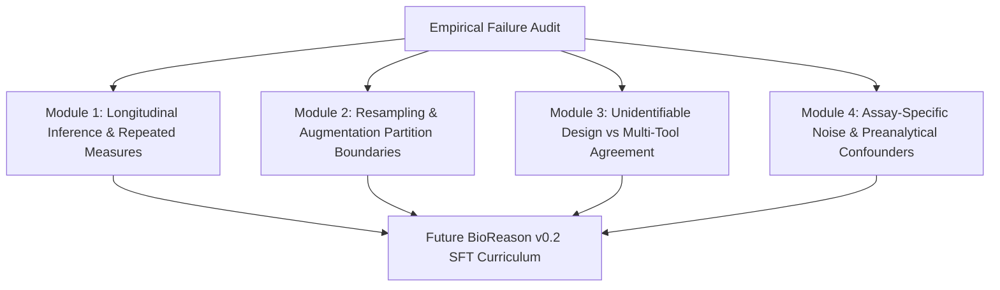

# BioReason v0.2 Curriculum & Training Plan

**Status**: V0_2_CURRICULUM_READY  
**Date**: 2026-09-15  
**Prerequisite**: Baseline Generalization & Error Audit Complete  

---

## 1. Training Priorities Ranked by Failure Frequency & Severity

Based on the empirical failure audit of frozen BioReason v0.1, the future v0.2 training curriculum is structured into four high-priority learning modules:

---

## 2. Curriculum Modules

### Module 1: Longitudinal Inference & Repeated Measures (Priority 1)
- **Core Concept**: Distinguishing observational units (N_obs over time) from independent biological subjects (N_subj).
- **Target Invariant**: Repeated measures require mixed-effects models (`~ time + (1|subject)`) or GEE; observations from one subject cannot cross train/test splits without `GroupKFold`.
- **Target Episode Count**: 50 episodes.

### Module 2: Resampling & Data Augmentation Boundaries (Priority 2)
- **Core Concept**: Placing SMOTE, ADASYN, bootstrapping, and image/sequence augmentations strictly inside training folds.
- **Target Invariant**: Test fold observations must never serve as interpolation anchors for synthetic samples.
- **Target Episode Count**: 40 episodes.

### Module 3: Unidentifiable Confounding vs Multi-Tool Consensus (Priority 3)
- **Core Concept**: Total collinearity between technical batch and phenotype renders biological signal unidentifiable regardless of algorithm consensus.
- **Target Invariant**: Tool agreement cannot rescue an unidentifiable experimental design.
- **Target Episode Count**: 40 episodes.

### Module 4: Assay-Specific Noise & Compositionality (Priority 4)
- **Core Concept**: 16S simplex closure, mass spec run-order instrument drift, Oxford Nanopore homopolymer indel calling, and CRISPR sorting bottlenecks.
- **Target Invariant**: Assay-specific physical constraints dictate valid statistical models.
- **Target Episode Count**: 40 episodes.

### Module 5: Hard-Negative Valid Scientific Designs (Priority 5)
- **Core Concept**: Preserving 100% specificity by reinforcing valid pseudobulk, spatial block CV, paired donor designs, and Schoenfeld residual survival models.
- **Target Episode Count**: 30 episodes.

---

## 3. Human Review & Quality Assurance Plan for v0.2
- **Candidate Episodes Authored**: 200 episodes in `training_data/v0.2/candidate_episodes_v0_2_full.json`.
- **Review Allocation**: 50% `TIER_A` (Dual Expert Validated), 50% `TIER_B` (Scientist Reviewed), 0% unreviewed.
- **Firewall Policy**: Zero overlap with `BioReasonBench-v0.2` and `BioReasonChallenge-v0.1` verified by Contamination Engine V4.

---

## 4. Next Steps for Phase 3 Increment 3
- Finalize SFT training configuration on the curated v0.2 curriculum.
- Execute controlled SFT ablation experiments on Unity HPC.
- Evaluate progress on `BioReasonBench-v0.2` and `BioReasonRegression-v0.1`.
