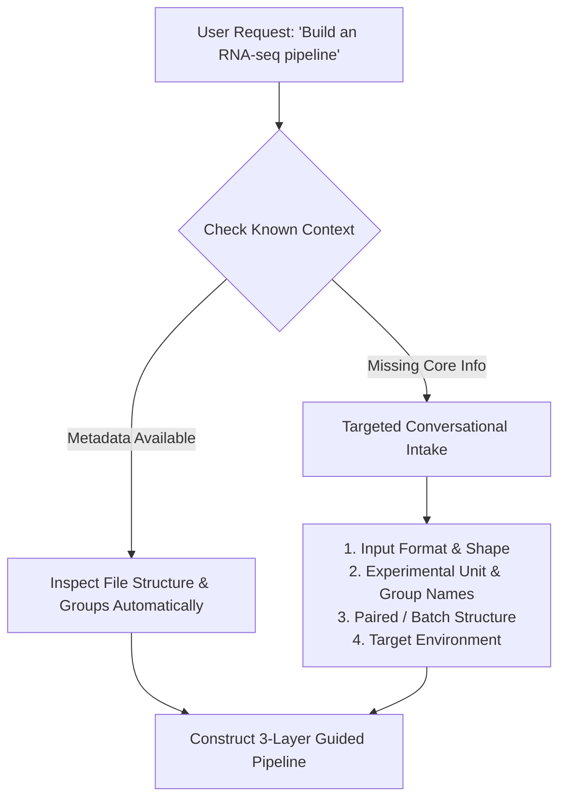

# BioReason Guided Pipeline Mode Specification

**Version**: `v0.2.0`  
**Core Product Principle**: *"Do not merely generate working code. Build an understandable scientific workflow around the user's actual experiment."*

---

## 1. Motivation & The Problem Solved

Standard AI coding assistants frequently generate opaque, monolithic bioinformatics code without first understanding:
1. The biological question and experimental hierarchy (e.g. biological vs. technical replicates).
2. The user's actual file structure, matrix orientation, and metadata formatting.
3. Where user-specific values and paths must be inserted.
4. What intermediate matrix transformations physically and biologically do to the data.
5. How to safely modify parameters or troubleshoot context-specific pipeline errors.

BioReason **Guided Pipeline Mode** bridges computational biology and laboratory science by treating domain-expert biologists and computational novices as first-class users.

---

## 2. Conversational Intake Flow

Before generating large pipelines, BioReason verifies the minimum necessary experimental context conversationally:



### Required vs. Optional Information
- **Required Before Pipeline**: File format/path, sample grouping, experimental unit level (patient/animal/cell), comparison contrast.
- **Optional (Sensible Defaults)**: Output directory name, plot DPI, clustering resolution, number of PCA components.

---

## 3. The Three-Layer Pipeline Architecture

```
+-----------------------------------------------------------------------------------------------+
| LAYER 1: PIPELINE FOUNDATION                                                                  |
| • Experimental Unit: Patient (N=12/group) | Measurement: Count Matrix (20,000 genes x 24 samples) |
| • Workflow Map: Counts -> Filter (retained genes computed at runtime) -> Log1p -> PCA (20 PCs) -> GroupKFold -> RF   |
| • Data Shape Progression: (20k x 24) -> (14.8k x 24) -> (24 x 14.8k) -> (24 x 20)           |
+---------------------------------------------------------------+-------------------------------+
| LAYER 2: CODE CHUNKS (Left Pane, ~55% Width)                  | LAYER 3: SYNCHRONIZED GUIDE   |
|                                                               | (Right Pane, ~45% Width)      |
| [1. USER CONFIGURATION]                                       | [1. FILE PATHS & SETUP]       |
| COUNTS_FILE = "/PATH/TO/counts.csv" # REPLACE THIS            | Replace path with actual file |
| METADATA_FILE = "/PATH/TO/metadata.csv"                       | e.g. "/Users/name/data/..."   |
| GROUP_COL = "condition"                                       |                               |
|                                                               |                               |
| [2. METADATA LOADING & VALIDATION]                            | [2. METADATA CHECKPOINT]      |
| meta = pd.read_csv(METADATA_FILE)                             | What is this? Loads groupings |
| assert set(meta['condition']) == {'Tumor', 'Normal'}          | Biological Assumption: Valid  |
|                                                               | Common Error: Sample ID mismatch|
| [3. LOW-COUNT FILTERING]                                      | [3. BIOLOGICAL FILTERING]     |
| keep = (counts >= 10).sum(axis=1) >= 6                        | Why? Removes uninformative noise|
| counts_filt = counts[keep]                                    | Retains: Robust transcript signal|
|                                                               | Data Out: retained genes x sample count (computed at runtime) |
| [4. LOG1P TRANSFORMATION]                                     | [4. NUMERICAL TRANSFORMATION] |
| norm = np.log1p(counts_filt.T)                                | Formula: y = log(1 + x)       |
|                                                               | Shrinks variance of extreme counts|
| [5. PCA & LOADINGS INSPECTION]                                | [5. PCA SCORES VS LOADINGS]   |
| pca = PCA(n_components=20)                                    | Scores = sample coordinates   |
| X_pca = pca.fit_transform(norm)                               | Loadings = gene weights (w1...)|
| top_pc1 = np.argsort(np.abs(pca.components_[0]))[-10:]        | Modify: N_COMPONENTS parameter |
+---------------------------------------------------------------+-------------------------------+
```

---

## 4. Key Interactive Components

### A. Synchronized Two-Pane View (`CODE | GUIDE`)
- **Left Pane**: Code broken into numbered, logical, scientifically meaningful blocks.
- **Right Pane**: Matching explanation cards explaining:
  1. **What is this? & Why are we doing it?**
  2. **Data In & Data Out** (with explicit dimension tracking).
  3. **What Biologically Changes?** (retained vs. lost information).
  4. **Underlying Assumptions** (independence, i.i.d., paired structures).
  5. **Where to Modify**: Explicit safe customization points.
  6. **Context-Aware Troubleshooting**: Common error codes with old/new code diffs.
- **Bidirectional Highlighting**: Hovering/clicking a code chunk highlights the corresponding guide card, and vice versa.

### B. Live Fill-in-the-Blank Configuration
Users can type their file paths or column names directly into UI fields, which dynamically updates the corresponding variables in the code chunk.

### C. Pedagogical Strictness Modes
1. **Standard**: Clean, balanced scientific commentary and instructions.
2. **Strict (Audit Warnings)**: Emphasizes data leakage traps, pseudoreplication hazards, and collinearity alerts.
3. **Teaching Mode**: In-depth explanations of computational concepts (e.g. PCA loadings matrix decomposition, StandardScaler axis orientation, cross-validation data leakage).

### D. Step-by-Step Walkthrough & Full Script Export
- **Step-by-Step Mode**: Allows running through the pipeline stage-by-stage for step-by-step validation.
- **Full Script Mode**: One-click copy or download of the entire consolidated `.py` or `.R` script.

---

## 5. Context-Aware Troubleshooting Engine

When a user encounters a runtime error:
1. **Identify the exact stage**: e.g., `Stage 2: Metadata Loading`.
2. **Diagnose likely root cause**: e.g., Sample ID index mismatch between count matrix and metadata.
3. **Provide exact code diff**:
   ```diff
   - counts = pd.read_csv(COUNTS_FILE, index_col=0)
   + counts = pd.read_csv(COUNTS_FILE, index_col=0).set_index('sample_id')
   ```
4. **Specific Insertion Instructions**:
   - File: `pipeline.py`
   - Section: `Metadata Loading & Alignment`
   - Line reference: Replace lines 14–16.
