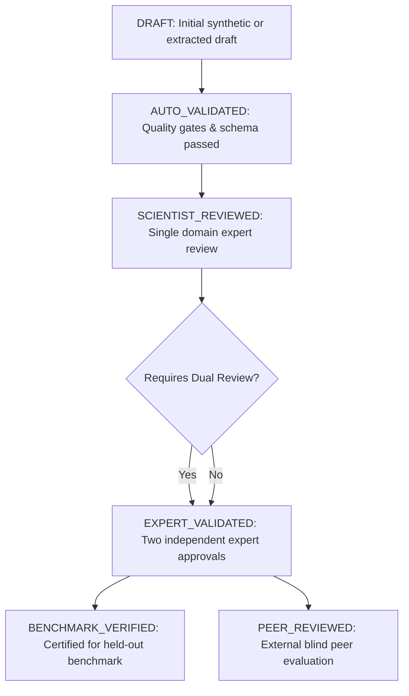

# BioReason Scientific Review Protocol

## Version 1.0 (BioReason v0.2 Release Preparation)

---

## 1. Executive Summary & Purpose

The **BioReason Scientific Review Protocol** establishes the formal guidelines, criteria, reviewer qualification tiers, and consensus procedures required for auditing, validating, and certifying scientific reasoning episodes, benchmark questions, and preference pairs.

In BioReason v0.1, auto-validation scaled dataset coverage, but the v0.1 audit demonstrated that expert human review is indispensable for subtle failure modes (e.g. longitudinal pseudoreplication, subtle SMOTE oversampling leakage, and tool-convergence adversarial confounding).

For **BioReason v0.2**, this protocol mandates that **at least 20–30% of core training data** and **100% of benchmark and challenge items** undergo formal scientific review.

---

## 2. Reviewer Roles and Qualification Matrix

| Role | Required Domain Background | Responsibility |
| :--- | :--- | :--- |
| **Domain Biologist** | Ph.D. or active researcher in molecular biology, genomics, neuroscience, oncology, or ecology | Validates biological plausibility, assay mechanics, realistic noise structures, and experimental context |
| **Biostatistician** | Graduate degree in Biostatistics or Statistics | Validates experimental units, degrees of freedom, distribution assumptions, variance stabilization, multiple testing, and power |
| **ML Validation Specialist** | Computational biologist or ML researcher with empirical biology experience | Validates feature selection scope, partition leakage, data augmentation boundaries, resampling leakage, and cross-validation hygiene |
| **Lead Scientific Editor** | Senior scientist on BioReason Working Group | Final adjudicator for inter-reviewer discrepancies, dual-review reconciliation, and benchmark item certification |

---

## 3. Scientific Review Lifecycle & Status Tiers

Every reasoning episode and benchmark item transitions through a strict status lifecycle:

### Review Status Definitions:
- `DRAFT`: Newly generated or ingested episode before automated gate validation.
- `AUTO_VALIDATED`: Syntactically valid, schema-compliant, passed automated rule-engine checks and Contamination Engine v4.
- `SCIENTIST_REVIEWED`: Evaluated and annotated by one qualified human scientist.
- `EXPERT_VALIDATED`: Confirmed by domain experts with verified rationale and correction steps.
- `BENCHMARK_VERIFIED`: Frozen and certified for benchmark or challenge evaluation partitions.
- `PEER_REVIEWED`: Evaluated in blinded multi-model external review studies.

---

## 4. Mandatory Dual-Review Policy

Independent dual review (two blinded reviewers followed by adjudication if discrepant) is strictly **mandatory** for episodes involving:

1. **Causal Claims & Mechanistic Inferences** (e.g., asserting target validation or therapeutic rescue from observational omics).
2. **Pseudoreplication & Hierarchical Designs** (e.g., single-cell clustering on repeated biopsies, technical replicates, organoid sub-samples).
3. **Clinical / Translational Assertions** (e.g., diagnostic biomarker claims, prognostic risk scoring).
4. **Inseparable Batch Confounding** (e.g., library preparation date matching disease state).
5. **Statistical Power & Low-N Assertions** (e.g., distinguishing low statistical power from pseudoreplication).
6. **Resampling / Augmentation Leakage** (e.g., SMOTE, ADASYN, bootstrapping across train/test splits).

---

## 5. Review Dimensions & Scoring Rubric

Reviewers evaluate episodes along six standardized ordinal dimensions (scale 1–5):

### 1. Scientific Correctness (1–5)
- **5 (Exemplary)**: Flaw diagnosis and biological rationale are indisputable, mathematically sound, and cite standard biological invariants.
- **3 (Acceptable)**: Diagnosis is correct but explanation contains minor non-fatal ambiguities.
- **1 (Flawed)**: Misdiagnoses the primary issue or recommends a statistically invalid method.

### 2. Experimental Unit & Observation Hierarchy (1–5)
- **5 (Flawless)**: Accurately isolates biological experimental unit vs observational units vs analysis units.
- **1 (Severe Error)**: Conflates technical replicates or subordinate cells with independent biological subjects.

### 3. Primary Issue Prioritization (1–5)
- **5 (Accurate)**: Explicitly identifies and prioritizes the fatal structural flaw (e.g. leakage) before secondary limitations.
- **1 (Misdirected)**: Focuses exclusively on superficial issues while ignoring fatal design flaws.

### 4. Correction Actionability (1–5)
- **5 (Concrete & Executable)**: Provides precise, step-by-step statistical or pipeline corrections (e.g. "Wrap SelectKBest in imblearn/sklearn Pipeline inside 5-fold StratifiedGroupKFold").
- **1 (Vague)**: Gives non-actionable platitudes (e.g. "Do better cross-validation").

### 5. Epistemic Claim Calibration (1–5)
- **5 (Calibrated)**: Confines findings to appropriate epistemic level (Observation vs Statistical Inference vs Biological Interpretation).
- **1 (Uncalibrated)**: Elevates correlational association or SHAP importance into causal biological claims.

### 6. Uncertainty & Limitation Disclosure (1–5)
- **5 (Comprehensive)**: Explicitly enumerates assay noise, unmeasured confounders, and generalizability bounds.
- **1 (Overconfident)**: Claims certainty in the presence of severe observational ambiguities.

---

## 6. Inter-Rater Reliability & Consensus Protocol

To ensure objectivity and quantify review consistency:

1. **Blind Review Assignment**: Reviewers receive randomized scenario identifiers without model or author metadata.
2. **Inter-Rater Agreement Metric**:
   - For categorical flaw classifications: **Cohen's Kappa ($\kappa$)** or **Fleiss' Kappa** ($> 0.80$ required for benchmark items).
   - For ordinal scores: **Krippendorff's Alpha ($\alpha$)** ($> 0.75$ required).
3. **Discrepancy Resolution**:
   - If $|\text{Score}_1 - \text{Score}_2| \ge 2$, the item is automatically escalated to the Lead Scientific Editor for joint adjudication.
   - If consensus cannot be reached, the scenario is archived in `AMBIGUOUS_JUDGMENT` and excluded from clean training and benchmark splits.

---

## 7. Quality Assurance Checklist for Reviewers

- [ ] Does the scenario specify independent biological replication ($N$ independent biological units)?
- [ ] Is observational unit distinguished from experimental unit?
- [ ] Are all data transformations, normalizations, and augmentations isolated strictly to training folds?
- [ ] Are batch variables cross-tabulated with experimental conditions to verify identifiability?
- [ ] Are multiple comparisons properly adjusted with FDR/FWER?
- [ ] Are feature importance metrics (SHAP, Gini, coefficients) classified strictly as associative without causal overreach?
- [ ] Are recommended corrections methodologically sound and supported by established peer-reviewed literature?
