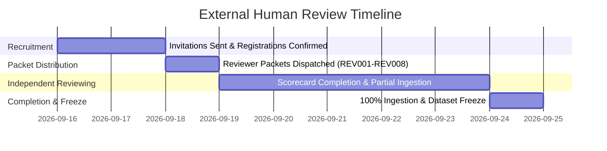

# BioReason v0.2 External Scientific Reviewer Recruitment Plan

**Protocol Version**: `v0.2.0`  
**Phase**: Phase 3 Increment 8C  
**Target Reviewer Cohort**: 8 Independent Domain Scientists & Quantitative Biologists  
**Planned Review Load**: 117 Total Case-Reviews across 50 Real-World Methodology Scenarios  

---

## 1. Objective & Recruitment Strategy

The primary objective is to engage an independent, qualified, double-blinded panel of practicing biological researchers and quantitative computational biologists to rigorously evaluate model-generated methodology critiques.

To ensure comprehensive domain and methodological coverage, the recruitment strategy targets 8 distinct reviewer slots representing orthogonal scientific disciplines.

---

## 2. Reviewer Cohort Structure & Target Expertise

| Reviewer Slot | Target Qualification Tier | Primary Disciplines | Target Workload |
| :--- | :--- | :--- | :--- |
| **`REV001`** | `BIOSTATISTICIAN` | Biostatistics, Survival Analysis, Longitudinal Omics | 14 Cases |
| **`REV002`** | `COMPUTATIONAL_BIOLOGIST` | Single-Cell RNA-seq, Spatial Transcriptomics, CRISPR Screens | 14 Cases |
| **`REV003`** | `BIOINFORMATICIAN` | ATAC-seq, Epigenomics, GWAS Genomics, Phylogenetics | 15 Cases |
| **`REV004`** | `EXPERT_DOMAIN` | Metabolomics, Quantitative Proteomics, Experimental Design | 15 Cases |
| **`REV005`** | `BIOSTATISTICIAN` | Biostatistics, Survival Analysis, Clinical / Trial Design | 14 Cases |
| **`REV006`** | `COMPUTATIONAL_BIOLOGIST` | Biological Machine Learning, Variant Interpretation, Screening | 15 Cases |
| **`REV007`** | `GENERAL_BIOLOGICAL_SCIENTIST` | Microbiome, Multi-Omics, Experimental Methodology | 15 Cases |
| **`REV008`** | `BIOINFORMATICIAN` | Statistical Genetics, Variant Interpretation, ATAC-seq | 15 Cases |

---

## 3. Reviewer Eligibility Criteria

### Mandatory Qualifications
- Advanced degree (Ph.D., M.D., or Master's with equivalent research experience) in Computational Biology, Biostatistics, Bioinformatics, Molecular Biology, Genetics, or related quantitative biological sciences.
- Practical research experience designing, executing, or analyzing high-throughput biological datasets or experimental cohorts.
- Working familiarity with common statistical and methodological vulnerabilities (e.g. pseudoreplication, sample leakage, batch confounding, multiple hypothesis testing, survivor bias).

### Diversity & Cross-Domain Representation
- Reviewers are not expected to be experts in all 15 biological sub-disciplines.
- The assignment matrix deliberately combines domain-specialist reviews with cross-domain evaluations to measure both technical accuracy and general scientific interpretability.

---

## 4. Scientific Independence & Conflict-of-Interest Standards

### Independence Principles
- **Separation of Roles**: Reviewers should not have participated in generating BioReason training episodes, authoring the locked final benchmark, or selecting checkpoint weights.
- **Unbiased Scoring**: Reviewers are instructed to evaluate each blinded response purely on its scientific, biological, and statistical merits without trying to guess the underlying model architecture.

### Conflict Disclosure Fields
During onboarding, reviewers disclose any relevant affiliations via the Reviewer Registry:
- `prior_bioreason_involvement` (`NONE`, `INFORMAL_FEEDBACK`, `CONTRIBUTOR`)
- `training_data_author` (`YES`, `NO`)
- `benchmark_author` (`YES`, `NO`)
- `model_development_involvement` (`YES`, `NO`)
- `financial_or_professional_conflict` (`NONE`, `DECLARED`)

Minor prior involvement does not automatically disqualify a reviewer but is transparently logged for auditability.

---

## 5. Reviewer Timeline & Milestone Commitments

- **Estimated Time per Reviewer**: ~45–75 minutes (~3–5 minutes per scenario).
- **Session Continuity**: Reviewers may complete their packet incrementally using the local `viewer.html` interface.
